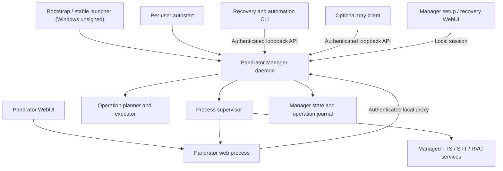

# Pandrator manager architecture and implementation plan

Status: **Accepted architecture; Manager 0.9.0 production cutover**

Date: 2026-07-28

## Current implementation status

The architectural control-plane slice is implemented. The repository contains
the Qt-free manager package, SQLite state and migrations, component registry
and immutable planner, durable operation engine, authenticated loopback API
and client, explicit private-network/HTTPS recovery profiles, process
supervisor, setup/recovery WebUI, CLI, per-user autostart adapters, optional
tray client, Pandrator same-origin proxy, stable managed provider bindings, and
contextual provider controls. Non-empty operations include typed preflight both
at plan time and immediately before mutation. The shared Pixi bootstrap is
platform-qualified, version- and digest-pinned, and rollback-journalled.

The release and recovery foundations are also implemented:

- threshold Ed25519 manifest verification, anti-downgrade sequencing, explicit
  key rotation, content-addressed acquisition, safe extraction, side-by-side
  application activation, health validation, and rollback;
- side-by-side manager releases with an authenticated external handoff, health
  acceptance, rollback, and a stable native launcher;
- non-mutating `doctor`, conservative and idempotent legacy inspection/import,
  ownership-based repair/removal, verified data export, preserve-by-default
  uninstall, explicit purge, and external final cleanup;
- bounded retry and Win32 extended-length-path cleanup for quarantined runtime
  trees, without deleting an unexpected residue path; and
- a wheel-first native build: PyInstaller consumes an extracted manager wheel,
  rejects checkout-source leakage, records the wheel digest, and excludes Qt.

The current verification snapshot is:

| Gate exercised | Result |
|---|---|
| Windows 11, Python 3.12, clean wheel install | Passed; package imports and CLI entry point work with no Qt package |
| Windows native bootstrap | Frozen manager `0.9.0` passes the wheel-fed self-check with all recovery assets, an exact source-wheel digest, no checkout leakage, and Authenticode deliberately absent |
| Windows native lifecycle | Passed custom-destination setup, persisted launcher and CLI rediscovery without `--workspace`, ephemeral test-key signed manager handoff, healthy takeover, preserve-data uninstall, long-path cleanup, and zero workspace residue |
| Fedora 44 x86_64, Python 3.12.13 | Manager `0.9.0` passed wheel build, wheel-fed PyInstaller build, Qt-free AppImage build/self-check, custom-destination persistence and rediscovery, signed handoff, preserve-data uninstall, and zero workspace residue in an isolated `/tmp` workspace |
| Fedora manager tests | Manager `0.9.0`: `158 passed, 3 platform-skipped` under Python 3.12.13 |
| Fedora real Kokoro installation | The frozen AppImage cloned and activated upstream revision `5fb4753`, built the CPU environment, downloaded the 327 MB model into the shared data root, selected system eSpeak safely, warmed all 68 voice packs, passed `/health`, and completed the durable install operation. A later managed start reused the installation and reached healthy in 14 seconds. The pre-existing container was restored after the isolated test |
| Fedora current remote-profile wheel smoke | Python 3.12.13; 40 core/launcher/doctor tests plus HTTPS recovery-session mutation, exact origin rejection, protected network state, and Qt-free import passed |
| Fedora real legacy migration | Passed against the existing `~/Pandrator`: 363 reviewed files / 2,555,885,163 bytes reconciled with no conflicts and all sources retained; 3 sessions, 360 artifacts, 1 source, and 2 voices verified in the canonical database |
| Fedora private-LAN E2E | Manager and Pandrator exposed explicitly on ports 8098/8097; owner login, three restored sessions, provider catalogue, API/worker health, and access from a Windows workstation passed. Manager `0.9.0` passed the editorial tabbed setup UI, full-width engine rows, lazy detail, Qwen/CrispASR defaults, multi-selection, consolidated notices, dropdown polling stability, keyboard navigation, and network routing. The remembered browser authorization survived a manager-only upgrade and the Pandrator API/worker PIDs were not restarted |
| Fedora headless tray | Optional tray extra reports a normal unavailable capability without a display and does not create a workspace |
| Windows manager tests and browser E2E | Manager `0.9.0` plus the Pandrator manager-proxy contract: `158 passed, 1 skipped`; focused manager-restart tests are ResourceWarning-clean, and the prior isolated browser session survived reload and manager restart and completed an authenticated plan-review POST |
| Repository Python tests on Windows | `902 passed, 1 skipped` across manager, installer compatibility, application, and WebUI backend batches |
| Svelte contract/build | Generated API refreshed; `svelte-check` reports zero errors/warnings and the production static build completes |

The qualification helper uses a short-lived generated test key and a
disposable workspace. It proves verification, handoff, cleanup, and rollback
plumbing; it does not substitute for the production release key ceremony or
real release artifacts. A separate, explicitly authorized Fedora migration
run exercised the existing installation after a consistent pre-migration
backup. That run found and fixed legacy CLI/health compatibility, missing
mutable-data reconciliation, Windows SQLite handle closure, insecure-context
UUID generation, legacy password-login handoff, and preservation of the web
migration marker and Flask session secret. It left the network instance
running for workstation testing and did not enable desktop autostart.

The provider-section decision is an information-architecture adjustment, not
an ownership change:

- provider-specific install/update/repair/remove, compute, health, and
  start/stop affordances appear beside the provider they affect;
- provider profiles persist only `external` or `managed_local` plus a stable
  service ID, never component installation state or a transient manager port;
- the canonical inventory, exact plans, operation journal, ownership, and
  process lifecycle remain manager-owned; and
- global operations, diagnostics, application/manager updates, migration,
  backup, and recovery remain global/recovery concerns.

The 0.9.0 cutover provisions the retained Ed25519 public trust root, publishes
signed Manager runtime manifests, adds automatic signed update discovery,
qualifies Manager-owned Kokoro and VoxCPM launch adapters, and fixes frozen
source-backed service launches. Pandrator and backend source updates retain
the simple clone-and-activate workflow: each update records the exact retrieved
commit and activates it side by side after validation. XTTS fine-tuning remains
explicitly unavailable rather than advertising an inferred training recipe.

Further hardening remains normal post-release work: SBOM/provenance automation,
additional legacy layouts and GPU families, autostart coverage across more
desktop sessions, low-resource/network-failure testing, an older-glibc Linux
builder, containers, and an optional PyPI publication. Qt remains a
feature-frozen compatibility fallback; no new lifecycle behavior belongs
there.

## Decision

Pandrator will replace the current Qt installer/launcher with a separately
packaged, per-user **Pandrator Manager**.

The manager will:

- install, update, repair, inspect, and uninstall Pandrator and its managed
  local services;
- supervise the Pandrator web application and selected local services;
- expose a versioned, authenticated loopback API by default and an explicit,
  policy-bound remote recovery profile;
- provide a complete recovery CLI;
- serve a small setup/recovery WebUI that remains available when the main
  Pandrator application is not installed or is unhealthy; and
- support an optional, separately running tray client.

The normal Pandrator WebUI will contain the complete host-management
experience. Its server will proxy authorized management requests to the local
manager so browsers use the existing same-origin Pandrator API and remote
browsers never receive the manager credential.

Qt is a migration-only surface. No new installer or launcher features should
be added to it. It will be removed from shipping artifacts as soon as the
manager, WebUI, recovery UI, CLI, and tray pass the cutover gates in this
document. A final tag or maintenance branch may be retained for emergency
reference, but there will be no extended period of dual feature development.

The Python distribution will be named `pandrator-manager`, with the import
package `pandrator_manager`. PyPI will be an official distribution channel for
developers, automation, and advanced users, but self-contained native bootstrap
artifacts remain the recommended end-user installation path.

## Alternatives rejected

| Alternative | Reason |
|---|---|
| Continue the full Qt installer/launcher | Preserves two presentation stacks, duplicated state/progress logic, Qt thread/lifetime risk, and larger platform artifacts |
| Put installation and supervision inside Pandrator | The control plane would disappear while repairing, replacing, or restarting the application |
| Let browser code directly manage processes/files | Browsers cannot safely own durable work, process identity, filesystem transactions, or elevation |
| Make the tray own the manager | Logging out, losing tray support, or closing the icon would stop the product control plane |
| Distribute only through PyPI | Does not solve absent Python runtimes, native OS integration, elevation, or consumer-grade recovery |
| Make the manager a privileged system service by default | Expands the security boundary and complicates access to per-user models, files, browser sessions, and credentials |

## Architectural principles

1. **One domain implementation**
   Installation, update, repair, process control, and component knowledge live
   in the manager core. The WebUI, recovery UI, CLI, tray, and any temporary Qt
   compatibility shell are clients; none reimplement workflows.

2. **The recovery plane outlives the application**
   The manager is not hosted inside the Pandrator web process. Stopping,
   repairing, or replacing Pandrator must not stop the component performing
   that work.

3. **Presentation is replaceable**
   Domain services do not import Qt, Flask request objects, Svelte concepts, or
   terminal formatting.

4. **Operations are planned, journalled, cancellable, and recoverable**
   A mutating request is not a long HTTP request or an unstructured thread. It
   becomes a durable operation with explicit steps, resource locks, progress,
   verification, and recovery behavior.

5. **Only owned processes and files are changed**
   PID existence, a matching process identity, and an ownership record are
   required before stopping a process or deleting a path.

6. **Per-user by default**
   The manager does not run permanently as administrator or root. Runtime
   dependencies should be private to the selected Pandrator installation
   wherever practical.

7. **The tray is optional**
   The manager, CLI, and browser surfaces remain complete when a desktop has no
   tray implementation or the tray process exits.

8. **Package once**
   CI builds and tests the `pandrator-manager` wheel first. Standalone Windows
   and Linux artifacts contain that exact wheel rather than building a second
   source variant.

## Goals

- Give users one primary UI for application and backend management.
- Support first installation even though the main Pandrator WebUI does not yet
  exist.
- Support repair and rollback when Pandrator cannot start.
- Make component state, progress, health, and logs observable in the WebUI.
- Preserve headless and automated operation.
- Work on supported Windows and Linux environments without Docker or WSL.
- Make updates and uninstall behavior explicit, transactional, and testable.
- Reduce installer packaging size and remove Qt-specific correctness and
  maintenance work.
- Keep container and externally managed deployments functional without a local
  manager.
- Support an explicit, authenticated network-deployment profile for rented GPU
  machines, pods, and home servers while keeping loopback-only operation the
  default.

## Non-goals for the first manager release

- A remotely exposed manager API by default, or an unauthenticated public
  installation surface.
- A system-wide, multi-user installation.
- Arbitrary command execution or user-supplied component plugins.
- Replacing Pandrator's provider, project, workflow, or credential stores.
- Making the tray a service owner or a required startup mechanism.
- Managing Docker hosts or remote machines from the manager.
- Acting as a multi-host fleet controller. A remotely opened manager still
  controls only the one workspace and host on which it runs.
- Supporting multiple Pandrator workspaces from one manager process. One
  manager instance owns one workspace; additional workspaces require separate
  instances.

## Process topology



The manager is the parent and authority for managed processes. The tray is
never the parent of the manager or service processes. Closing the browser or
tray therefore has no runtime effect unless the user explicitly requests a
stop operation.

## Runtime modes

### Desktop installation

- One per-user manager runs for the selected workspace.
- Windows uses a per-user logon task or equivalent user startup registration.
- Linux uses a `systemd --user` unit when available, with a foreground fallback
  for desktops without user systemd.
- The optional tray starts separately in the interactive desktop session.
- The manager starts Pandrator and configured services according to their
  desired runtime state.

### Headless installation

- The same manager wheel and CLI are used.
- A user systemd unit or an external service manager starts
  `pandrator-manager daemon`.
- Browser opening and tray startup are disabled.
- Enabling Linux user lingering is an explicit administrator/user decision,
  not an automatic package-install side effect.

### Container or externally managed deployment

- The Pandrator application does not require `pandrator-manager` to import or
  start.
- Its capability response reports host management as unavailable.
- Manager controls are hidden or replaced with deployment-specific guidance.
- External TTS and other provider endpoints continue to work normally.

## Package and module boundaries

The existing `pandrator_installer` project evolves into a composed manager
package rather than being wrapped by another installer implementation.

Proposed high-level package structure:

```text
pandrator_manager/
    application.py          composition and use-case boundary
    context.py              immutable paths, platform, reporter, cancellation
    client.py               typed manager API client
    cli.py                  user-facing CLI adapter
    daemon.py               process entry point and lifecycle
    api/                    loopback HTTP transport and schemas
    auth/                   client credentials and recovery sessions
    state/                  SQLite store, migrations, repositories
    operations/             planning, task graph, journal, rollback
    components/             registry and component drivers
    environments/           Pixi and Python environment management
    artifacts/              downloads, hashes, signatures, extraction
    processes/              command runner, identity, process trees
    supervisor/             desired state, health, restart policy
    releases/               signed app and manager activation
    tray/                   optional client and platform adapters
    recovery_ui/            built static setup/recovery assets
```

Dependencies point inward:

```text
WebUI / recovery UI / CLI / tray / compatibility entry points
                           |
                           v
                  application use cases
                           |
              +------------+-------------+
              |                          |
              v                          v
       operation engine           process supervisor
              |                          |
              +------------+-------------+
                           |
                           v
       component drivers, stores, and platform adapters
```

The manager application layer receives an explicit `ManagerContext`. Stateful
mixins and implicit window attributes are not part of the target design.

### Product entry points

The combined product installation exposes:

```text
pandrator                 Existing Pandrator application CLI
pandrator-manager         Manager CLI and daemon administration
pandrator-tray            Optional tray process
pandrator-installer       Temporary compatibility alias
```

The compatibility alias should print a deprecation notice and dispatch to the
new manager CLI or open the browser setup surface. It must not retain the Qt
application.

### Initial implementation technologies

These choices minimize new infrastructure while keeping the domain independent
of them:

- Flask application factory and Waitress for the loopback manager API;
- Pydantic models as the API validation/schema boundary;
- server-sent events for operation and supervisor updates;
- `requests` in the Python manager client;
- the standard-library `sqlite3` module with explicit forward migrations,
  WAL, a busy timeout, and short transactions;
- `psutil` plus platform process-group/Windows Job Object adapters for process
  identity and tree ownership; and
- `pystray` behind the optional tray adapter initially, with a direct
  StatusNotifier implementation permitted if Linux desktop coverage requires
  it.

The operation engine, component drivers, state model, and supervisor policies
must not depend on Flask, Waitress, `requests`, or the tray implementation.

## Workspace and filesystem ownership

One `WorkspaceLayout` implementation is authoritative across installation,
runtime, update, repair, and uninstall. Logical ownership zones are kept
separate even when they share one selected parent directory:

```text
<workspace>/Pandrator/
    bin/                  stable launchers and handoff helper
    manager/versions/     versioned manager runtimes
    app/versions/         versioned Pandrator application runtimes
    services/             managed service source/runtime slots
    envs/                 Pixi environments
    state/                manager database, descriptor, lock, manifests
    logs/                 manager and supervised-process logs
    cache/                disposable downloads and package/model caches
    data/                 user database, sessions, artifacts, voices, uploads
```

The final physical migration can preserve compatible existing directories,
but all code must address them through `WorkspaceLayout`; hard-coded repository
and legacy database paths are not allowed.

Properties:

- `runtime`, `services`, and `envs` are manager-owned.
- `data` is user-owned and preserved by default.
- `cache` is disposable but is not automatically erased after every successful
  operation.
- `state` belongs to the manager and is separate from Pandrator's application
  database.
- Unknown pre-existing files are never inferred to be manager-owned.
- Paths in operation plans are canonicalized and checked against an allowed
  ownership root before a write, move, or deletion.
- The default installation is owned only by the current user. Elevation must
  not be followed by a recursive broad `Users:F` ACL.

The manager always launches Pandrator with an explicit `PANDRATOR_DATA_DIR`.
Migration reconciles the current platform-default and workspace-relative data
locations before any cleanup or uninstall is permitted.

## Manager state

The manager owns a separate SQLite database. Only the manager process writes
it; other clients use the API.

It records at least:

- manager schema and product compatibility versions;
- the canonical workspace layout;
- component desired state, resolved variant, installed version/revision, and
  last successful inspection;
- stable managed-service IDs, assigned ports, endpoint capabilities, and
  service desired runtime state;
- release slots and the active release pointer;
- operation, step, progress, cancellation, and recovery state;
- owned path/artifact manifests;
- supervised process identities and restart history;
- bounded, redacted operation events; and
- one-time completion markers for legacy imports.

Configuration must be typed and versioned. A component has one stable identity
and separate desired and resolved configuration. GPU and CPU variants are not
represented as independent accumulated boolean flags.

Example conceptual state:

```json
{
  "component_id": "fish_speech",
  "desired": {
    "present": true,
    "compute": "auto",
    "quantization": "q6_k"
  },
  "resolved": {
    "compute": "cpu",
    "quantization": "q6_k",
    "platform": "win_amd64"
  },
  "installed_revision": "..."
}
```

Manager database migrations are independent from Pandrator application
database migrations. A corrupt legacy JSON file is quarantined and reported;
it is never silently overwritten by default configuration.

## Component model

The existing catalogue becomes the source of declarative component metadata.
Imperative behavior is supplied through registered component drivers.

Each component definition includes:

- stable ID and display metadata;
- supported platforms, architectures, and compute variants;
- dependencies, conflicts, and resource locks;
- license/usage notices;
- expected download and installed-size information;
- configurable ports and required capabilities; and
- its driver identifier.

Each component driver implements a narrow contract:

```text
inspect(context, desired) -> ComponentInspection
plan_install(context, desired, inspection) -> OperationPlan
plan_update(context, desired, inspection) -> OperationPlan
plan_repair(context, desired, inspection) -> OperationPlan
plan_remove(context, inspection) -> OperationPlan
launch_spec(context, resolved) -> ManagedProcessSpec | None
health_probe(context, instance) -> HealthResult
```

Plans contain typed tasks rather than shell strings supplied by an API caller.
A task declares:

- dependencies and resource locks;
- expected inputs and outputs;
- estimated downloads and disk requirements;
- whether explicit license, destructive-action, restart, or elevation
  confirmation is required;
- a cancellation boundary;
- verification behavior; and
- rollback or recovery behavior.

The registry rejects duplicate component IDs, service keys, ports, environment
owners, and incompatible selected variants before execution.

## Operation lifecycle

All mutations follow a plan/confirm/execute model:

1. The client submits desired state and the expected configuration revision.
2. The manager inspects the host and produces an immutable, expiring plan.
3. The plan reports changes, downloads, disk requirements, licenses, service
   interruption, elevation, conflicts, and preservation behavior.
4. The user or automation confirms that exact plan.
5. The manager creates a durable operation and returns its ID immediately.
6. Clients observe snapshots and ordered events, and may request cancellation.
7. The manager verifies results and either commits, rolls back, or records
   precise recovery-required state.

Operation states:

```text
queued
planning
awaiting_confirmation
running
cancelling
rolling_back
succeeded
failed
cancelled
recovery_required
```

Rules:

- Only one filesystem-mutating operation runs per workspace.
- Read-only inspection and health requests may run concurrently.
- API mutations require an idempotency key.
- Expected revisions prevent two browser tabs from applying stale plans.
- Progress is task- and byte-based where measurable, not fabricated from a
  fixed sequence of percentages.
- Cancellation is cooperative first and forceful only at declared subprocess
  boundaries.
- Every child process is placed in a process group or Windows Job Object and
  is terminated and waited for on timeout or cancellation.
- An interrupted operation is examined on the next manager start. Completed
  verified tasks are not repeated; staged but uncommitted work is rolled back
  or resumed according to the task contract.
- Logs and persisted errors are bounded and redact credentials, tokens, signed
  recovery URLs, and environment secrets.

## Installation and update transaction model

Repositories and environments are not updated in place merely because a
directory exists.

Installation and update use:

1. preflight inspection, writeability, platform, path-length, network/proxy,
   custom CA, disk, port, and running-job checks;
2. downloads into a content-addressed cache with pinned digests;
3. extraction and environment construction in staging paths;
4. dependency and import verification;
5. service-specific readiness probes;
6. application database snapshot and migration where applicable;
7. atomic activation of a versioned slot or pointer;
8. post-activation health checks; and
9. rollback before old slots are pruned.

A signed release manifest is the only product update authority. It includes
the Pandrator wheel, compatible manager version/range, dependency lock,
frontend assets, migrations, platform artifacts, and hashes. The trust root is
embedded in the bootstrap/manager, supports explicit key rotation, and enforces
anti-downgrade policy. A public key supplied ad hoc by a caller is not a trust
decision.

Here, **signed** means an Ed25519 signature over canonical release metadata
and artifact hashes. It does not mean Windows Authenticode. Ed25519 release
signing uses a project-controlled offline key and does not require an EV
certificate or certificate authority.

Manager self-update is a handoff:

- the running manager verifies and stages a side-by-side manager version;
- a stable minimal launcher/handoff helper starts the new version;
- the new manager validates its state schema and health before becoming active;
- the previous version remains available for rollback.

The running manager never upgrades its active environment with `pip`.
PyPI-managed installations instead report the external `pipx`/`uv` upgrade
command and require an orderly manager restart.

## Supervisor model

The manager supervisor replaces launcher-owned and in-memory process handles.

Every `ManagedProcessSpec` contains:

- a unique service key and component owner;
- a fully resolved executable, arguments, working directory, and sanitized
  environment;
- declared ports;
- startup and shutdown dependencies;
- a typed readiness and ongoing health probe;
- expected service identity and compatible version;
- restart policy, backoff, and circuit-breaker limits; and
- log and resource policy.

The supervisor records and validates PID, process creation time, normalized
executable, manager instance ID, and child service identity. A PID alone is
never sufficient to stop a process.

Additional rules:

- Port ownership is checked before launch. An occupied port owned by an
  unrecognized process is reported as a conflict and that process is not
  killed.
- A successful generic HTTP response is not sufficient health evidence.
  Health payloads must identify the expected service and compatible protocol.
- Both exited and live-but-unhealthy processes participate in restart policy.
- Restart attempts use bounded exponential backoff and enter a visible failed
  state after the limit.
- Deliberate stop, update, uninstall, and cancellation do not trigger restart.
- Shutdown follows reverse dependency order.
- The manager can stop Pandrator without stopping itself.
- `Stop everything` stops managed children; `Stop manager` is a separate
  administrative command.

## API and client topology

### Manager API

The manager binds to loopback by default, selecting an available port and
atomically writing a protected connection descriptor. An explicit persisted
server profile may instead bind a fixed port for private-network or
HTTPS-ingress access. Even in that profile, the descriptor used by native
clients and Pandrator records only the manager's internal loopback endpoint.
A random per-install client secret is stored in a file readable only by the
owning user and is never exposed to a remote browser. Native IPC may replace
the local transport later without changing the application use cases or client
interface.

The API is versioned and described by a generated contract. Representative
resources are:

```text
GET  /v1/status
GET  /v1/capabilities
GET  /v1/components
GET  /v1/components/{id}
GET  /v1/services
GET  /v1/services/{id}
POST /v1/plans
POST /v1/operations
GET  /v1/operations
GET  /v1/operations/{id}
POST /v1/operations/{id}/cancel
GET  /v1/events
GET  /v1/logs
GET  /v1/network
PUT  /v1/network/application
POST /v1/runtime/start
POST /v1/runtime/stop
POST /v1/runtime/restart
POST /v1/recovery-sessions
```

The exact resource model should be finalized in OpenAPI before frontend
implementation. Commands accept typed component IDs, desired state, and
operation options; there is no arbitrary command, environment, URL, or path
execution endpoint.

Events carry a monotonic cursor, operation/component/service identifiers, and
redacted typed payloads. Clients resume with their last cursor; when the cursor
predates bounded retention, the API explicitly requires a fresh snapshot
instead of silently replaying incomplete state.

### Normal Pandrator WebUI

The Svelte frontend calls same-origin Pandrator endpoints under
`/api/v1/manager`. A dedicated Pandrator `manager` Blueprint:

- applies existing owner authentication and CSRF policy;
- forwards the bounded manager contract through a local `ManagerClient`;
- never returns the manager bearer credential;
- annotates whether the authenticated request is local or remote; and
- degrades to a typed `manager_unavailable` capability response.

One process-level `ManagerBridge`, constructed through `ApplicationServices`,
maintains the Pandrator process's manager event subscription. It republishes
sanitized `manager.*` events through Pandrator's existing event/invalidation
system. Browser tabs therefore do not each consume a manager SSE connection.
Routes return canonical snapshots and bounded log tails; events tell the
owning frontend store what to patch or refresh.

The bridge reconnects using the manager event cursor. If its cursor has expired
or Pandrator restarted during an operation, it refreshes the active-operation
and supervisor snapshots before resuming events.

Remote owner sessions in the normal Pandrator WebUI may inspect state and
operate runtime services. Host mutations through that same-origin proxy
require a local session by default and are enabled remotely only by the
deployment-level `PANDRATOR_ALLOW_REMOTE_MANAGER_MUTATIONS=1` policy. This is
not implied by exposing Pandrator. The separately exposed setup/recovery
surface is the intentional remote-host administration path. A short-lived,
single-use launch token authorizes a durable, revocable browser session, which
may submit the same reviewed install, update, repair, and remove operations as
a local browser session.

### Setup and recovery WebUI

The manager wheel contains a small static setup/recovery build. It supports:

- first-run workspace and multi-component selection;
- plan review, licenses, disk estimates, and confirmation;
- operation progress, cancellation, and log tails;
- one central Pandrator start/open control, with its API and worker hidden as
  implementation details by default;
- diagnostics, repair, update rollback status, and uninstall choices; and
- recovery when the main Pandrator server is absent.

The guided setup information architecture is fixed as follows:

1. **Three stable work areas replace one long dashboard.** Install & launch
   contains the application and optional engines; Maintenance contains
   application update/repair, network access, diagnostics, migration, signed
   offline recovery, and uninstall; Activity contains recent operations,
   service details, and manager internals. A running operation remains visible
   above the tabs.
2. **Pandrator comes first without masquerading as an engine.** A compact,
   dedicated application row is always first and exposes its plain state plus
   the one primary action. It is preselected when absent. Optional selections
   automatically retain Pandrator, and one immutable plan may contain several
   selected items.
3. **Optional sections match the established mental model.** Components are
   grouped as Text to speech, Speech to text, Speech to speech, and Training
   tools. Groups and their calm, full-width engine rows expand on demand. The
   disclosure chevron occupies the same top-right position for every row.
4. **The catalogue teaches without requiring technical knowledge.** A
   collapsed row uses plain text for a short description and genuine
   user-facing features such as voice cloning or pre-built voices. Language
   breadth and hardware requirements are not presented as capabilities.
   Expanded content adds the Qt-era plain-language guidance, languages, model
   families, model-specific licences, usage constraints, compute choices,
   quantization, and model estimates without duplicating the collapsed feature
   line. Expanded detail is constructed lazily.
5. **Install choices are typed.** Qwen exposes Base/CustomVoice/both, 0.6B/1.7B,
   and precision with invalid combinations prevented. CrispASR exposes
   Whisper, Parakeet, and MOSS plus their valid quantizations. Comparable
   component-specific choices use the same schema rather than free-form
   dictionaries in browser code.
6. **Estimates state their provenance.** A wrapper may eventually publish or
   measure its artifact sizes. For upstream services outside project-owned
   wrappers, including Kokoro, the manager may provide a clearly labelled,
   deliberately rounded estimate. Approximate estimates inform disk preflight
   but cannot be treated as byte-exact authority. Runtime-only and on-demand
   model estimates are distinguished.
7. **Pandrator is one application action.** A normal user sees Start Pandrator,
   Open Pandrator, Restart, and Stop. The manager orders and supervises the API
   and worker together. Per-process controls appear only in advanced technical
   diagnostics.
8. **Opening is an authenticated handoff.** Start/open asks the running
   Pandrator process for a short-lived browser bootstrap token through an
   authenticated manager-only loopback endpoint. The user is not sent to an
   unauthenticated application URL and must not see a 401 after a successful
   manager start.
9. **Activity includes direct lifecycle actions.** Start, stop, restart,
   browser-open preparation, failures, and durable install/update/repair
   operations share a user-visible recent-activity projection. A direct
   lifecycle failure cannot disappear merely because it was not an install
   operation.
10. **Live status preserves interaction state.** Polling updates status nodes in
   place. It does not replace a focused card, native select, expanded section,
   or current multi-selection. Dropdowns use the shared editorial palette and
   buttons have visible hover, focus, pressed, disabled, and busy states.
11. **Normal updates remain simple.** Reviewing a Pandrator component update
    stages a fresh repository clone and
    activates it side by side; it never mutates the active checkout in place.
    The production path has the same one-click experience backed by an
    automatically discovered project-signed release manifest. Manual manifest
    selection is an advanced/offline recovery affordance, not the primary
    update workflow. The same release channel can update the manager through
    its external handoff, so users do not normally download a new executable.
12. **Remote-host setup is explicit and usable.** Loopback remains the default.
    A server/pod profile may expose both setup/recovery and Pandrator through
    exact browser-facing URLs. Private-network HTTP requires an explicit
    acknowledgement and is intended only for a trusted LAN/VPN. Public cloud
    deployment uses an HTTPS ingress or reverse proxy with an exact trusted
    host and an explicit proxy-hop count. Remote Pandrator access requires an
    owner password; setup links remain short-lived and single-use. The UI shows
    the address the workstation should open instead of substituting
    `localhost`.

The manager mints a short-lived, single-use browser launch token for the CLI or
tray. The token is placed in the URL fragment, exchanged once, and immediately
removed from browser history. Its replacement is an opaque, per-browser,
same-site/HTTP-only cookie; only the cookie's SHA-256 digest is stored in the
protected manager database. Browser authorization therefore survives manager
restarts and ordinary release handoffs without exposing the durable manager
client credential.

Loopback and HTTPS sessions use a 30-day sliding inactivity window with a
90-day absolute limit. Explicit private-network HTTP offers a remembered
browser with a 7-day inactivity window and 30-day absolute limit, or a
browser-session-only cookie backed by a 12-hour server authorization. The
authenticated session endpoint re-establishes CSRF state after page reloads.
Sliding-expiry writes are coalesced rather than written on every status poll.
The UI can revoke the current browser or every authorized browser.

The session security context is derived from the protected manager client
secret and the exact manager exposure profile. Rotating that credential or
materially changing the manager's bind/public/proxy boundary invalidates old
browser records; ordinary manager updates do not. Workspace replacement and
uninstall naturally remove the manager database. The recovery server also
validates `Host`, `Origin`, CSRF state, and the configured peer/exposure policy
and does not enable CORS. HTTPS mode uses Secure cookies. Owner passwords
cannot be submitted to the manager over remote plain HTTP.

For a headless server or rented GPU machine, the native first-run command can
persist both browser-facing origins before the daemon starts:

```text
pandrator-manager-launcher setup \
  --workspace /srv/pandrator \
  --remote-setup-url https://setup.example.test \
  --remote-pandrator-url https://pandrator.example.test \
  --trusted-proxy-hops 1 \
  --no-open
```

`--no-open` suppresses the server-side browser but still prints the expiring,
one-use workstation recovery URL. HTTPS-proxy mode listens on loopback by
default. A pod ingress in another network namespace must add
`--network-bind-host 0.0.0.0` and enforce the corresponding pod/network policy.
Direct trusted-LAN HTTP instead uses explicit `http://host:port` URLs plus
`--allow-insecure-private-network`; its public and listening ports must match.
The owner password is entered through HTTPS or initialized on the server. It
may be supplied once through the deployment secret
`PANDRATOR_OWNER_PASSWORD`, but is consumed from the environment and never
written to `network.json`, logs, operation inputs, or child backend
environments.

Management presentation components and models are shared between the normal
Pandrator route and the recovery build, but each host has its own API adapter.
This gives first-install recovery and the integrated application experience
without duplicating business logic or depending on the main application.

### API compatibility

- Manager API major version is explicit.
- `/v1/capabilities` reports manager version, supported API versions, and
  feature flags.
- Product releases initially keep Pandrator and manager versions in lockstep.
- Release manifests state compatible manager and application ranges.
- The WebUI hides unsupported actions instead of guessing behavior.
- CI verifies the manager OpenAPI, generated clients, proxy contract, and
  recovery bundle do not drift.

## Provider, service, and component integration

Pandrator exposes local installation options contextually, but installation
state is not stored in provider profiles.

The three related identities remain distinct:

| Identity | Owner | Meaning |
|---|---|---|
| Component | Manager component registry | Installable software, environment, models, and variant |
| Managed service | Manager supervisor | One runnable instance with a stable ID, dynamic endpoint, health, and lifecycle |
| Provider profile | Pandrator application | User-facing configuration, model choices, credentials, defaults, and workflow references |

A provider profile referring to a managed service stores its stable
`managed_service_id`, not a hard-coded localhost port. Pandrator resolves the
current endpoint and capabilities through `ManagerClient`. Manager-owned
endpoint fields are displayed as read-only and labelled **Managed by Pandrator
Manager**. External provider profiles continue to store and test explicitly
configured endpoints.

Installing a component makes its managed service available to Pandrator. It
does not silently select that provider as a default, overwrite an external
profile, or delete an existing profile. Removing a component requires a plan
that reports provider profiles, defaults, sessions, or workflows that still
refer to its services.

### WebUI surfaces

| Surface | Purpose |
|---|---|
| Providers & Services | Configure providers and models; show contextual install, start, repair, and manage actions for related local services |
| Local Components | Canonical inventory and complete install, variant, update, repair, removal, version, license, and disk-use controls |
| Global Operations | Persistent progress, cancellation, failures, required confirmations, and log access across navigation |
| Setup/recovery WebUI | First installation and the same component operations when Pandrator is absent or unhealthy |

Provider cards project manager state without owning it:

- **Not installed** offers **Install locally** when a compatible component and
  manager are available.
- **Installed, stopped** offers **Start service**.
- **Starting or installing** links to the durable operation.
- **Healthy** shows resolved capabilities and provider configuration.
- **Update available** links to the manager plan.
- **Unhealthy** offers diagnostics or repair.
- **Externally managed** retains endpoint and credential controls.
- **Manager unavailable** offers external configuration or deployment-specific
  guidance instead of a nonfunctional install action.

An **Install locally** action opens the same immutable manager plan used by the
Local Components and recovery surfaces. The dialog includes resolved compute
variant, model selection, downloads, disk requirements, license, restart
impact, and elevation requirements. Confirmation creates a normal durable
manager operation; the provider page does not run a separate workflow.

`ApplicationServices` owns one manager/service discovery projection, and the
frontend owns one typed manager store. Provider cards, Local Components, and
Global Operations consume those shared resources rather than polling or
caching manager state independently.

Local host mutations remain unavailable to remote Pandrator browser sessions
by default. A single-owner server deployment can opt into them explicitly, or
use the remotely exposed setup/recovery surface. Container and externally
managed deployments may omit installation controls while preserving external
provider configuration.

## Tray architecture

The tray is an optional, unprivileged process built on `ManagerClient`.

Initial menu:

- Open Pandrator
- Open Manager / Recovery
- overall and per-service status
- Start everything
- Stop everything
- Restart failed services
- open logs
- start tray on login
- Quit tray

`Quit tray` only exits the tray. Stopping the manager or uninstalling is never
an accidental consequence of closing a desktop UI.

The target tray implementation must not require Qt. Platform behavior is
hidden behind a small adapter:

- Windows uses a lightweight native notification-area implementation.
- Linux uses StatusNotifier/AppIndicator behavior when available and
  feature-detects unsupported desktop sessions.

Linux tray unavailability is a normal capability result, not a manager startup
failure. During migration, a stripped Qt tray may temporarily consume the same
manager API, but PyQt is removed from default and final artifacts.

The PyPI distribution exposes tray dependencies through an optional
`pandrator-manager[tray]` extra. The core manager and CLI do not import them.

## Security boundary

- The manager runs as the owning user and binds only to loopback by default.
  Remote recovery is enabled only by a validated persisted deployment profile
  with a fixed port, exact public origin, and exact trusted hosts.
- Private-network HTTP is an explicit lower-security profile for trusted
  LAN/VPN use. Public/rented-host deployments use HTTPS termination and an
  explicit trusted proxy-hop count; forwarded headers are otherwise ignored.
- Connection descriptor, client credential, state, and operation files receive
  restrictive per-user permissions/ACLs.
- The main Pandrator server is a constrained authenticated proxy, not a source
  of shell commands.
- Browser launch tokens are short-lived and single-use. The resulting
  per-browser sessions are bounded, revocable, same-site, CSRF-protected,
  hashed at rest, and bound to the manager credential and network exposure.
  The persistent manager bearer credential remains server-side.
- Host and origin validation remain active in both loopback and remote modes.
- Downloads require HTTPS by default, pinned digests, size limits, timeouts,
  and safe staged extraction.
- Existing valid custom CA/proxy configuration is preserved.
- Archive members, symlinks, wheel tags, architectures, and target paths are
  validated before extraction or installation.
- The release trust root is embedded and rotated through an already trusted
  signed statement.
- The manager never accepts a public key, executable path, or raw command from
  the WebUI as authority.
- Elevation is exceptional. An allowlisted helper receives a signed,
  short-lived operation description and performs only the approved OS action.
  It does not run the manager daemon with elevated privileges.
- Private runtime dependencies are preferred over system-wide installation.
- Logs, events, diagnostics bundles, and API errors are secret-redacted.

## Repair and uninstall semantics

`doctor` performs a non-mutating inspection of:

- manager/application release slots and active pointers;
- manager and application databases and migration versions;
- component source revisions and environment manifests;
- executable imports and binary/version probes;
- model/artifact presence and hashes where tracked;
- service ports, health identity, process ownership, and log availability;
- writeability, free space, custom CA/proxy configuration, and path limits; and
- stale operation, lock, staging, backup, and cache state.

`repair` first produces a plan and repairs only failed or explicitly selected
checks.

Uninstall:

1. validates and stops owned processes;
2. identifies paths from the ownership manifest;
3. offers preservation/export options;
4. removes manager-owned application, service, environment, state, and OS
   integration entries;
5. preserves `data` by default;
6. removes data only after explicit purge confirmation; and
7. runs the stable helper last if it must remove the active manager runtime.

Supported user choices:

```text
pandrator-manager uninstall
pandrator-manager uninstall --preserve-data
pandrator-manager uninstall --export-data <destination>
pandrator-manager uninstall --purge-data
```

Removing the PyPI wheel is not treated as product uninstall. Package tools
remove Python files; the manager command owns managed component and data
semantics.

## Distribution

### PyPI

Publish `pandrator-manager` as a conventional wheel and source distribution,
subject to confirming the distribution name is available before the first
public release.
It must:

- install without network side effects beyond normal package resolution;
- perform no service registration, elevation, component download, or host
  mutation from build/install hooks;
- keep the core importable without GUI dependencies;
- include the recovery static assets as package data;
- support Python 3.11 and 3.12 for the initial release; and
- expose optional `tray` and `build` extras.

Advanced installation:

```text
pipx install pandrator-manager
pandrator-manager --workspace /path/to/workspace start-manager

# Optional desktop convenience only
pipx install "pandrator-manager[tray]" --force
pandrator-tray --workspace /path/to/workspace --check
```

Equivalent `uv tool install` use is supported. A normal `pip install` remains
valid for development and controlled environments but is not the consumer
recommendation. The project metadata, wheel, and source distribution are
buildable and have passed clean-environment smoke tests; this document does
not claim that version `0.9.0` has been uploaded to public PyPI.

### Native end-user artifacts

- Windows: an Authenticode-unsigned bootstrap executable with a stable
  launcher/handoff helper. Windows can display **Unknown publisher** or
  SmartScreen warnings.
- Linux desktop: a checksummed AppImage or bootstrap bundle authenticated by
  the project's Ed25519 release manifest.
- The manager AppImage wraps the same wheel-fed native bootstrap used by the
  release bundle. First setup installs that bootstrap into the workspace, so
  daemon startup and recovery never depend on an AppImage mount or desktop
  session.
- Linux package repositories may later provide native packages and user units.

The absence of Authenticode is an explicit product constraint, not a failed
release check. The bootstrap, application bundles, and manager bundles are
still hashed and authenticated by the project release manifest. This protects
downloads after a trusted manager/bootstrap is running, but it cannot give the
very first Windows download an OS-recognized publisher identity. Release notes
must publish the SHA-256 value and verification instructions, and `pipx`/`uv
tool` remains the alternative installation path for users who do not want to
run an unknown-publisher executable.

The bootstrap:

1. resolves and validates the workspace, using a Qt-free native directory
   chooser on first interactive launch and atomically remembering the
   canonical selection in per-user platform configuration;
2. contains manager code from one validated wheel and installs itself as the
   stable external launcher;
3. starts that embedded manager as the first healthy fallback runtime;
4. activates later authenticated manager bundles in side-by-side versioned
   slots through the handoff protocol;
5. registers per-user autostart only when explicitly requested;
6. opens the manager setup UI unless suppressed; and
7. delegates all product installation to the manager API.

It contains no component-specific installer workflow.

The repository CI workflow builds and tests the wheel, freezes that exact
wheel into platform bootstraps, exercises signed handoff and uninstall, and
uploads qualification artifacts on Windows and Linux. Production release
automation must extend that record with the application artifacts, offline
Ed25519 signatures, dependency locks, checksums, SBOM, provenance, and
promotion policy.

## Migration from the current code

| Current area | Target |
|---|---|
| `catalog.py`, typed selections, platform metadata | Normalize into the component registry and versioned desired-state schemas |
| `HeadlessInstaller` and six stateful mixins | Replace incrementally with composed services and component drivers |
| `lifecycle.py` | Split into application use cases, manager daemon commands, and a thin API-client CLI |
| `supervisor.py` | Retain useful process-group behavior but replace file-command control and weak health/identity handling with the manager supervisor |
| `update.py` signed activation | Move behind the unified release manager and embedded trust policy |
| GUI worker/reporting signals | Replace with durable operation events |
| `gui/` and Qt stylesheet/application | Remove at WebUI cutover |
| PyInstaller GUI launcher | Replace with the stable bootstrap and manager launcher |
| Legacy JSON configuration | Import once into typed manager SQLite state; quarantine malformed input |
| Current source updater | Remove; all UI and CLI updates use the signed release manager |

The migration importer is conservative and idempotent:

- discover the existing workspace and all known current data-root candidates;
- snapshot existing configuration before conversion;
- reconstruct installed state using component inspection rather than flags
  alone;
- record legacy paths as owned only after positive component identification;
- preserve unknown paths;
- map old CPU/GPU flags into one desired/resolved variant;
- retain a migration report and rollback marker; and
- never delete legacy state in the same operation that first imports it.

## Implementation plan

### Phase 0 — Freeze Qt and remove immediate hazards

Purpose: make the current release safe enough to serve as the migration base.

Status: **implemented and covered by compatibility regression tests**.

Work:

- Declare Qt feature-frozen and link this architecture from migration
  documentation.
- Remove the recursive Windows `Users:F` ACL behavior.
- Centralize process identity validation for every stop/update path.
- Handle malformed lock and runtime JSON without crashing or overwriting it.
- Reject duplicate runtime keys and ports before launch.
- Require service-identity health responses.
- Fix Fish Speech CPU installation/readiness/configuration/update consistency.
- Make every timed-out process terminate and wait for its process tree.
- Route temporary Qt worker notifications through queued signals and make
  close/tray-exit behavior safe while an operation is active.
- Preserve valid custom CA configuration.
- Add focused regression tests for each item.

Exit criteria:

- No update, stop, or uninstall path trusts a bare PID.
- No normal installation grants broad write access after elevation.
- Known Qt-thread errors cannot silently suppress an installation error.
- Installer tests, compile checks, and the offscreen GUI smoke check pass.

### Phase 1 — Establish the manager core and state contract

Purpose: create the long-lived architecture without changing the user surface.

Status: **implemented**. Clean wheel/source-distribution and Qt-free import
checks pass on Windows and Fedora; public publication remains a Phase 5 task.

Work:

- Create the `pandrator_manager` package and composition root.
- Add `ManagerContext`, `WorkspaceLayout`, cancellation, clock, reporter/event
  sink, and platform interfaces.
- Introduce the manager SQLite store and migrations.
- Define component, desired-state, inspection, plan, task, operation, process,
  managed-service binding, health, and error schemas.
- Implement the component registry and reject duplicate ownership.
- Add a central command runner, downloader, safe extractor, artifact verifier,
  environment manager, and path-boundary service.
- Implement the legacy configuration/workspace importer.
- Port `list`, `probe`, and pure `plan` behavior first.
- Build the wheel in clean Python 3.11 and 3.12 environments.

Exit criteria:

- The core has no Qt imports or window-owned state.
- `list`, `probe`, and `plan` run through composed services.
- Manager state survives restart and migrates forward.
- Legacy inspection is read-only until a plan is confirmed.
- Architecture tests enforce dependency direction and absence of stateful
  mixin composition in new code.

### Phase 2 — Daemon, supervisor, API, CLI, and tray vertical slice

Purpose: establish the durable control plane before moving every component.

Status: **control-plane slice implemented**. Fake/lightweight service,
disconnect, restart, optional-tray, and platform adapter coverage passes.
Qualification of a production backend recipe remains in Phase 3.

Work:

- Implement the per-workspace daemon, validated lock, protected connection
  descriptor, and client credential.
- Implement the versioned loopback API, OpenAPI contract, client, idempotency,
  snapshots, and event stream.
- Replace the supervisor with unique services/ports, full process identities,
  typed health, process groups/Job Objects, restart backoff, and ordered
  shutdown.
- Convert the CLI into an API client, retaining bootstrap/start/recovery
  commands for a stopped manager.
- Port Pandrator application launch plus one representative backend end to end.
- Add per-user Windows and Linux autostart adapters.
- Implement the optional tray client and capability-based Linux fallback.
- Exercise manager, tray, browser, and child-process failure independently.

Exit criteria:

- The manager survives the application and tray exiting.
- The CLI can start or recover a stopped manager.
- No unowned port occupant or PID is terminated.
- Status and progress survive client disconnect/reconnect.
- Tray absence has no effect on manager readiness.
- A fake component integration suite runs on Windows and Linux CI.

### Phase 3 — Port and harden the complete lifecycle

Purpose: make the manager authoritative for all product mutations.

Status: **transaction, release, recovery, ownership, doctor, migration,
uninstall, production trust, and primary inference recipes implemented;
additional hardware breadth remains ongoing**.

Work:

- Implement the durable operation/task journal, locks, cancellation, restart
  recovery, staging, verification, activation, and rollback.
- Port each supported component to the driver contract.
- Generate complete Pixi manifests and solve once per environment plan.
- Add disk/download estimates, cache policy, offline reuse, proxy/custom CA,
  path-length, architecture, ABI/wheel-tag, and port preflight.
- Unify installation and update behind signed release/component manifests.
- Maintain the embedded release trust root, key rotation, and anti-downgrade policy.
- Implement side-by-side application activation and manager self-update
  handoff.
- Implement ownership manifests, `doctor`, selective repair, complete
  uninstall, data export/preserve/purge, and backup pruning.
- Add fault injection after every activation boundary.

Exit criteria:

- Every current component can install, inspect, start, stop, update, repair,
  and remove through the manager or explicitly reports an unsupported action.
- Interrupted operations recover deterministically.
- Signed update failure restores the previous healthy app and database.
- Manager self-update either activates a healthy new manager or returns to the
  previous version.
- Uninstall leaves no manager-owned runtime while preserving user data by
  default.

### Phase 4 — WebUI control plane and Qt removal

Purpose: complete the user migration without a prolonged dual-UI period.

Status: **proxy, generated contract, canonical component projection,
provider-context actions, stable managed bindings, global operation banner,
and recovery surface implemented**. Full operation parity, browser
accessibility/E2E qualification, real first installation, and Qt deletion
remain gated.

Work:

- Add the Pandrator manager proxy Blueprint and generated contract.
- Add a typed manager client/store to the Svelte frontend.
- Build the canonical Local Components inventory, variant selection, planning,
  license, install/update/remove, runtime, progress, logs, diagnostics, repair,
  and uninstall views.
- Add contextual managed-local installation and lifecycle actions to Providers
  & Services without moving component state into provider profiles.
- Add stable managed-service discovery and binding, including explicit
  `managed_local` and `external` provider modes.
- Add a global operation surface that survives route changes and reconnects to
  durable operations.
- Share manager presentation components with the standalone setup/recovery
  build through separate API adapters.
- Implement first-run installation, application redirect, reconnect to active
  operations, manager-unavailable behavior, and remote-operation policy.
- Qualify the private-network and HTTPS-ingress deployment profiles, including
  one-use setup links, trusted-host rejection, proxy spoofing resistance,
  Secure cookies, owner-password bootstrap, and workstation-facing launch URLs.
- Add keyboard, screen-reader, high-contrast, responsive, and browser tests.
- Change legacy GUI entry points to open the setup/recovery WebUI during the
  cutover prerelease.
- Create the final Qt tag/maintenance branch.
- Delete Qt application code, GUI tests/spec hooks, PyQt default/build
  dependencies, and GUI-only compatibility state before the production
  cutover release.

Exit criteria:

- The WebUI and CLI expose every supported manager operation.
- Provider cards and Local Components project the same canonical manager state
  and submit the same plan contract.
- Managed provider bindings survive service port changes, and installation
  never silently changes the user's default provider.
- First installation works without Pandrator being installed.
- Repair works while Pandrator is deliberately broken or stopped.
- An operation continues across browser/app restart and reconnects by ID.
- Local and remote authorization behavior is covered.
- Packaged Windows and Linux tests pass with no Qt installed.

### Phase 5 — Packaging, qualification, and rollout

Purpose: make the new architecture the only supported consumer path.

Status: **wheel-first build, cross-platform CI definition, Windows packaged
lifecycle, Fedora packaged lifecycle, clean wheel install, headless-tray
fallback, and unsigned-Windows policy implemented/validated locally**. Public
channels, production signing/provenance, VM/hardware matrix, and rollout
remain.

Work:

- Publish test `pandrator-manager` wheels and install them with `pipx` and
  `uv tool` on Windows and Linux.
- Build reproducible native bootstraps from the same wheel; Windows outputs
  remain explicitly Authenticode-unsigned.
- Add clean-install, legacy-migration, update/rollback, repair, and uninstall
  virtual-machine workflows.
- Test spaces, Unicode, long paths, low disk, interrupted network, offline
  cache, proxies, custom CAs, corrupt state, stale PIDs, occupied ports, and
  forced process timeouts.
- Exercise representative CPU and GPU service variants on suitable hardware.
- Produce release signing, checksums, SBOM, provenance, and key-rotation
  evidence.
- Update README, Linux compatibility, administrator, recovery, and developer
  packaging documentation.
- Release to a preview channel, migrate representative existing
  installations, then promote the same artifacts.
- Remove the `pandrator-installer` compatibility alias in the following
  breaking release after a clear deprecation window.

Exit criteria:

- External Windows and Linux gates are approved with packaged artifacts; an
  absent Windows Authenticode signature is expected and recorded.
- A real legacy installation migrates without user-data movement or loss.
- Recovery and rollback work without source checkout or development tools.
- Published wheel and standalone artifacts report the same manager build and
  release manifest.
- Qt is absent from shipping dependency graphs and artifacts.

## Suggested delivery slices

Keep changes reviewable and vertically testable:

1. Current-installer safety fixes.
2. Manager package skeleton, paths, state, and schemas.
3. Catalogue/inspection and legacy import.
4. Command runner and operation journal.
5. Manager daemon, authentication, client, and API contract.
6. New supervisor and Pandrator launch.
7. One backend driver and fake-driver integration harness.
8. Remaining backend drivers.
9. Signed app update and manager handoff.
10. Doctor, repair, ownership, and uninstall.
11. Pandrator API proxy, managed-service binding, WebUI store, and global
    operations.
12. Provider contextual actions, Local Components, and shared recovery UI.
13. Tray and platform autostart.
14. Qt deletion and packaging cleanup.
15. Signed platform artifact qualification.

Avoid commits that simultaneously move a component implementation, alter its
behavior, and delete its characterization tests.

## Test strategy

### Unit and contract tests

- schemas, configuration migrations, path containment, ownership, component
  dependencies, variant resolution, plan determinism, idempotency, state
  transitions, cancellation, health identity, and restart policy;
- manager OpenAPI and generated-client drift;
- driver contract tests shared by every component; and
- tray menu/status behavior against a fake client.

### Integration tests

- real manager daemon with fake lightweight child services;
- daemon restart during each operation state;
- duplicate IDs/ports, stale PID reuse, corrupt lock/state, hung service,
  occupied port, cancellation, timeout, and log rotation;
- application proxy authentication, CSRF, local/remote policy, disconnect and
  event replay;
- stable managed-service binding, port reassignment, provider impact analysis,
  and manager-unavailable behavior; and
- signed update, database migration, failed health, rollback, and manager
  handoff with test keys.

### Browser tests

- first setup before Pandrator exists;
- component plan and confirmation;
- contextual provider installation, managed/external mode, and default-provider
  preservation;
- install progress, reconnect, cancellation, retry, and failure diagnostics;
- start/stop/restart and tray-independent behavior;
- update/repair/uninstall preservation choices; and
- accessibility and Chromium/Firefox coverage.

### Packaged system tests

- clean and migrated Windows installations;
- clean and migrated Linux installations;
- standalone artifact startup with no system Python;
- PyPI installation in isolated tools;
- login autostart with and without tray support;
- custom workspace paths, proxies/CAs, low disk, and interrupted network;
- representative real services on CPU and supported GPU paths; and
- uninstall with preserved, exported, and purged data.

## Cutover gates

Qt can be deleted once all of the following are true:

- a checksummed, manifest-authenticated bootstrap can install and start the
  manager on Windows and Linux;
- setup/recovery WebUI completes a clean Pandrator installation;
- an existing installer configuration migrates idempotently;
- the integrated WebUI can plan and control all supported components;
- provider cards link to the same component plans and stable managed-service
  identities without duplicating installation state;
- CLI parity exists for automation and recovery;
- signed application update and rollback pass;
- manager update handoff passes;
- app-down repair works through the recovery UI and CLI;
- tray unavailable/crashed tests pass;
- process identity, port conflict, cancellation, and crash-recovery tests pass;
- uninstall preserves data by default and purge requires explicit
  confirmation; and
- Qt-free packaged smoke tests pass.

These are cutover gates, not a requirement to keep Qt for an additional
release after they pass.

## Definition of done

The migration is complete when:

- `pandrator-manager` is the only implementation of installation and host
  lifecycle behavior;
- the main and recovery WebUIs consume the versioned manager contract;
- the CLI and optional tray are thin clients;
- all managed state is typed, versioned, and recoverable;
- all processes and deleted files require verified ownership;
- update, repair, and uninstall use the same component and operation model;
- Windows and Linux standalone and PyPI paths are release-qualified;
- Qt code and dependencies are absent from shipping artifacts; and
- documentation no longer instructs users to return to a desktop installer
  window for normal management.
