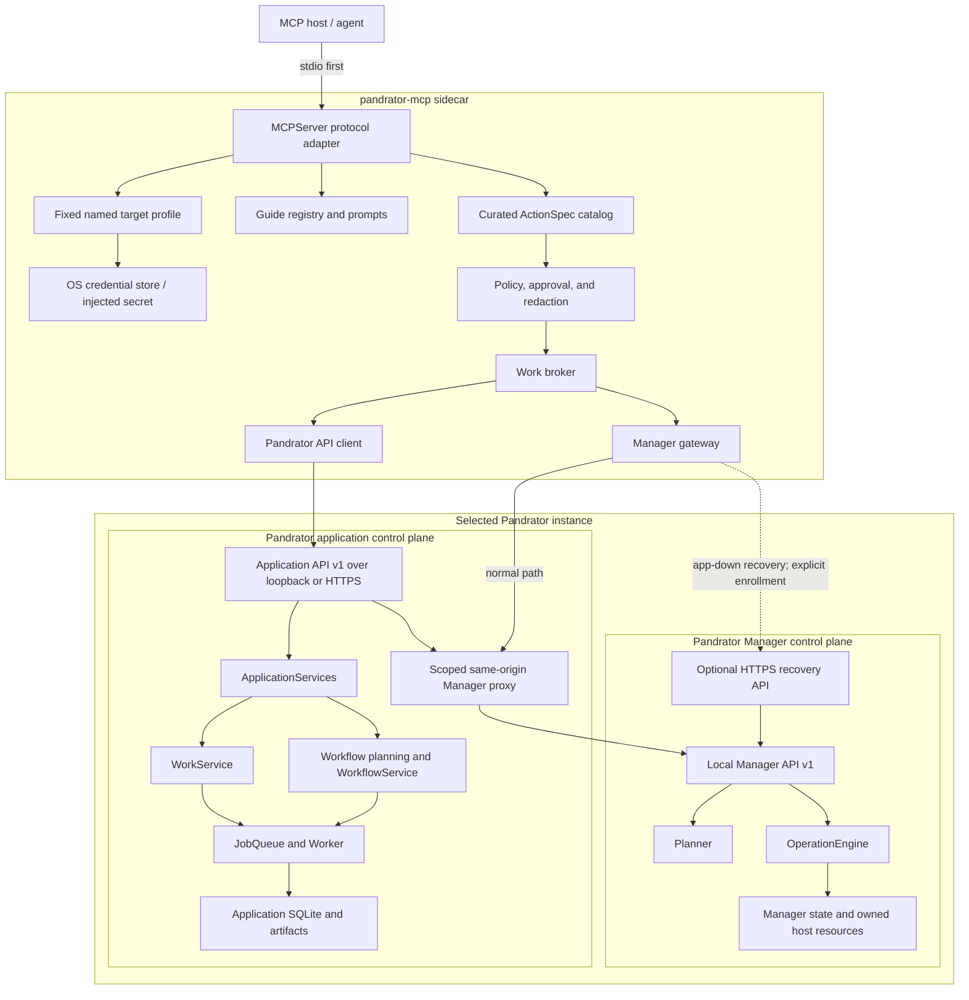

# Pandrator MCP architecture and implementation plan

Status: **Reference architecture and initial Fedora/Codex qualification
implemented in this working tree; broader `1.0` qualification pending**

Date: 2026-07-28

Protocol baseline: MCP `2026-07-28`, official Python SDK `2.0.0`

## Implementation snapshot

The current working tree implements the foundation and the first bounded
action slices:

- standalone `pandrator-mcp` packaging with an exact MCP SDK pin;
- Graphify-backed architecture tracing and guardrail tests;
- versioned packaged guides and explain/next-step tools;
- fixed local-managed, LAN/VPN, external HTTPS, and external-application
  target profiles with DNS, TLS, redirect, proxy, metadata-address, and
  identity policy;
- browser/TTY native application enrollment with S256 PKCE and OS-keyring
  storage;
- scoped application principals, audit events, idempotency records, and
  atomic T1 session writes;
- payload-free durable-work projections and redacted events;
- immutable application workflow plans and exact plan execution;
- Manager application-proxy tools for status, diagnostics, plans, runtime
  control, execution, and cancellation;
- separate, scoped, expiring, rate-limited Manager recovery enrollment with
  exact HTTPS-origin and instance binding;
- failover to direct recovery only for availability failures;
- secret-free host configuration generators for Codex, Claude Code, OpenCode
  V2, and Antigravity; and
- explicit local logout plus owner-side application/Manager client rotation
  and revocation UX;
- remote/home/pod setup documentation; and
- a fresh Fedora 44 remote-target qualification through Codex 0.145.0,
  including read, explain, write, immutable plan, execute, observe,
  lost-response replay, rotation, revocation, and local cleanup.

Work still required before calling this a qualified `1.0` release:

- run the full TLS/network, worker, restart, and app-down recovery integration
  matrix;
- keep Codex as the initial maintained live host gate and record its pinned
  version; qualify other host templates only when they become maintained
  compatibility targets;
- complete MCP Inspector, external-HTTPS, and app-down Manager recovery
  smokes; the initial Windows clean-wheel/stdio and Fedora target smokes are
  recorded;
- finish dependency/secret scans and SBOM generation; and
- publish versioned compatibility and release records.

The initial qualification record is
`docs/qualification/pandrator-mcp-0.1.0-fedora44-codex-0.145.0.md`.

## Decision

Pandrator will provide a separately packaged MCP server named
`pandrator-mcp`, with the import package `pandrator_mcp`.

The MCP server will be a semantic, policy-enforcing sidecar over Pandrator's
two existing control planes:

- the Pandrator application API for projects, settings, artifacts, workflows,
  and durable jobs; and
- the Pandrator Manager API for installation, repair, updates, and runtime
  supervision.

The MCP server will not:

- construct `ApplicationServices`;
- import or access Pandrator's application database;
- import `JobQueue`, run a worker, or register job handlers;
- submit arbitrary job kinds;
- expose arbitrary HTTP requests, filesystem paths, commands, or URLs;
- duplicate workflow or manager planning;
- store secrets in tool arguments, results, logs, or durable MCP state; or
- become a third orchestration authority.

The architectural rule is:

> MCP adapts user intent to existing Pandrator control planes. Durable state,
> planning, validation, execution, and recovery remain owned by Pandrator.

Local stdio is the first supported **MCP transport**, but it is not limited to
a local Pandrator installation. From the first supported release, the stdio
sidecar can control one fixed, named Pandrator target that is:

- managed on the same computer;
- on an explicitly trusted LAN or VPN;
- exposed by an external HTTPS server or GPU pod; or
- externally managed without Pandrator Manager.

Hosting the MCP endpoint itself over Streamable HTTP is a different topology.
It remains a later, separately gated deployment profile.

## Why `JobQueue` appears to bridge nine communities

Graphify reports 112 direct edges for `JobQueue`, spanning its own community
and nine other communities.

| Community | Direct edges | Extracted | Inferred | What it represents |
|---|---:|---:|---:|---|
| 23 | 46 | 40 | 6 | Queue internals, job models, worker lifecycle, concurrency tests |
| 6 | 21 | 11 | 10 | Workflow and workspace services plus their tests |
| 4 | 15 | 7 | 8 | Application composition, database, and application tests |
| 25 | 14 | 13 | 1 | Standalone and remote-capable CLI commands |
| 89 | 9 | 6 | 3 | Phase-zero benchmarks and performance baselines |
| 21 | 3 | 0 | 3 | Credential redaction and its tests |
| 32 | 1 | 1 | 0 | `ApplicationServices.build()` |
| 18 | 1 | 0 | 1 | `AgentRun` lifecycle projection |
| 70 | 1 | 0 | 1 | Data-path migration tests |
| 175 | 1 | 0 | 1 | Web API tests |

The bridge is therefore not nine independent production domains. It consists
of four strong production seams and several test/benchmark clusters:

1. **Durability engine**
   `JobQueue` owns enqueueing, claiming, lease fencing, retries, cancellation,
   resource leases, progress, completion, and the job event log.

2. **Domain submission**
   `WorkflowService`, `GenerationService`, and several route handlers enqueue
   durable work.

3. **Composition and adapters**
   `ApplicationServices` constructs the queue once for the web process, while
   standalone CLI invocations construct a queue in their own short-lived
   process.

4. **Cross-cutting projection**
   The queue currently also owns diagnostic redaction and produces the event
   projection consumed by HTTP/SSE clients. The generic worker contains a
   special-case `AgentRun` status projection.

Graphify undercounts one important coupling: `api_routes.py` captures the
injected queue as the local name `jobs`, so AST matching does not connect all
of its `jobs.enqueue()`, `jobs.get()`, and `jobs.events_after()` calls back to
the `JobQueue` class.

### Architectural consequences of the trace

The queue itself is proven infrastructure and should not be replaced. The
integration boundary around it should be improved:

1. Add a `WorkService` façade for redacted read, log, cancel, event, and
   stable `WorkRef` projection operations.
2. Keep raw enqueueing internal to domain services.
3. Never expose `POST /api/v1/jobs` through MCP. Deprecate it for ordinary
   clients and eventually require an explicit administrative scope.
4. Construct `SecretRedactor` separately in `ApplicationServices` and inject
   it into `JobQueue`, `ApiGuards`, and audit projection. HTTP error handling
   must not depend on a queue merely to redact a message.
5. Add an in-transaction queue submission method so consuming a workflow plan
   and creating its job can be atomic.
6. Move the worker's `AgentRun` special case to a registered lifecycle hook
   after the MCP foundation is stable. This is worthwhile cleanup but is not a
   prerequisite for the read-only MCP.
7. Retain direct `JobQueue` construction in standalone CLI/worker processes
   only. MCP always uses the versioned HTTP API.

## Goals

- Let agents accurately explain how Pandrator works.
- Provide guidance based on curated documentation and live state.
- Let agents inspect projects, capabilities, workflows, artifacts, jobs, and
  manager health.
- Support reversible application changes with concurrency protection.
- Support costly or destructive actions through inspectable, immutable plans.
- Reuse Pandrator's durable jobs and Manager operations for long-running work.
- Remain useful when the application is down by retaining static guides and
  Manager diagnostics and, for explicitly enrolled remote targets, Manager
  recovery.
- Preserve the local-first, single-user experience.
- Make a LAN, home-server, external-server, or pod target easy to enroll,
  verify, use, revoke, and troubleshoot without placing credentials in agent
  context.
- Produce deterministic, typed, redacted results suitable for different MCP
  hosts.
- Support protocol negotiation with 2026-era and earlier MCP clients through
  the official SDK.

## Non-goals for the first release

- A general-purpose Pandrator HTTP proxy.
- Arbitrary job submission.
- Arbitrary local or remote file access.
- Credential collection through model-visible forms.
- Model-selected target URLs or per-tool endpoint overrides.
- Unauthenticated or default-open remote management.
- A remotely hosted Streamable HTTP MCP endpoint in the first release.
- Multi-user policy administration.
- A replacement for the Pandrator WebUI.
- A replacement for the application worker or Manager operation engine.
- Native MCP Tasks before the official Python SDK implements the extension.
- Automatic use of a server-side LLM to explain Pandrator.
- Cross-host fleet management.

## Process topology



The normal remote topology therefore exposes only Pandrator over HTTPS. The
application keeps the permanent Manager client credential server-side and
forwards its bounded Manager contract. Direct access to the Manager recovery
endpoint is optional and exists only so an enrolled agent can diagnose, start,
repair, or update the instance while the application is unavailable.

### Remote-support decisions

| Question | Decision |
|---|---|
| Where does MCP run for 1.0? | As a local stdio sidecar launched by the agent host |
| Can Pandrator be remote? | Yes: fixed named LAN/VPN, external HTTPS, server, pod, or externally managed targets are first-class |
| How are normal Manager calls made remotely? | Through Pandrator's bounded same-origin Manager proxy |
| How does recovery work when Pandrator is down? | Optional direct HTTPS Manager recovery using a separate scoped credential |
| Can an agent choose an endpoint? | No; a human selects one target profile at process startup |
| Where are secrets kept? | OS credential store or an explicit deployment secret source, never MCP/host config |
| What proves the endpoint is still the enrolled installation? | Exact origin plus durable application and Manager instance IDs |
| Is a remotely hosted MCP endpoint required? | No; Streamable HTTP is an independent post-1.0 deployment option |

## MCP protocol and SDK baseline

Use the official `mcp` Python package and the high-level
`mcp.server.MCPServer` API.

Initial dependency policy:

```toml
mcp = "==2.0.0"
```

The exact version remains locked until Pandrator's conformance and host matrix
passes against a later release. The package constraint may be relaxed after
that gate.

The SDK's v2 server supports the `2026-07-28` protocol and earlier revisions
from the same server. The 2026 protocol is stateless and requires explicit
handles for state that spans calls. This matches Pandrator's durable job,
workflow-plan, and Manager-operation identifiers.

The Python SDK `2.0.0` does not include the Tasks extension. The first release
therefore uses explicit `WorkRef` handles and read/cancel tools. When the
official extension becomes available, those handles can be projected as MCP
Tasks without changing Pandrator's durable state.

Do not depend on deprecated MCP roots, sampling, or protocol logging.

- Local logs go to stderr; stdout remains exclusively MCP framing.
- Structured observability uses OpenTelemetry.
- W3C trace context is propagated to downstream application and Manager calls.
- Tool, resource, and prompt listing order is deterministic.
- All schemas are bounded Pydantic models and produce JSON Schema 2020-12.

References:

- <https://github.com/modelcontextprotocol/python-sdk/releases/tag/v2.0.0>
- <https://py.sdk.modelcontextprotocol.io/>
- <https://py.sdk.modelcontextprotocol.io/whats-new/>
- <https://blog.modelcontextprotocol.io/posts/2026-07-28-release-candidate/>
- <https://modelcontextprotocol.io/docs/tutorials/security/security_best_practices>
- <https://modelcontextprotocol.io/docs/tutorials/security/authorization>

## Distribution and runtime

Create a separate project following the Manager's repository layout:

```text
pandrator_mcp/
  pyproject.toml
  README.md
  LICENSE
  __init__.py
  __main__.py
  server.py
  settings.py
  targets.py
  credentials.py
  network_policy.py
  lifespan.py
  catalog.py
  context.py
  errors.py
  policy.py
  approval.py
  audit.py
  redaction.py
  work.py
  clients/
    __init__.py
    application.py
    manager_gateway.py
    manager_proxy.py
    manager_recovery.py
  schemas/
    __init__.py
    common.py
    guidance.py
    sessions.py
    workflow.py
    work.py
    manager.py
  tools/
    __init__.py
    guidance.py
    system.py
    sessions.py
    workflow.py
    work.py
    manager.py
  guides/
    index.json
    overview.md
    audiobook.md
    subtitles.md
    dubbing.md
    voices-and-providers.md
    artifacts-and-revisions.md
    jobs-and-recovery.md
    manager.md
    remote-targets.md
    home-and-lan.md
    external-server-and-pods.md
    privacy-and-external-services.md
  prompts.py
  resources.py
```

Package name and entry point:

```toml
[project]
name = "pandrator-mcp"

[project.scripts]
pandrator-mcp = "pandrator_mcp.__main__:main"
```

Runtime dependencies:

- `mcp==2.0.0`;
- `pydantic>=2.10,<3`;
- `anyio>=4,<5`;
- `requests>=2.32,<3`; and
- an optional native credential-store extra; and
- an optional `manager` extra using `pandrator-manager>=0.9,<1`.

The native Pandrator distribution includes the Manager and native
credential-store extras. Container or externally managed deployments may
install the base package and inject secrets from their platform secret store.

The process supports:

```text
pandrator-mcp stdio --target TARGET
pandrator-mcp doctor --target TARGET
pandrator-mcp target add TARGET [non-secret connection options]
pandrator-mcp target login TARGET
pandrator-mcp target test TARGET
pandrator-mcp target list
pandrator-mcp target remove TARGET
pandrator-mcp host-config {codex|claude-code|opencode|antigravity} --target TARGET
pandrator-mcp print-config
```

`target add`, `target login`, and `target remove` are human-operated CLI
commands, not MCP tools. A token is never accepted on a command line. Interactive
enrollment uses a trusted browser or a hidden TTY/standard-input fallback.
`host-config` emits a secret-free, versioned stdio configuration; it references
only the executable and target name.

Streamable HTTP is not enabled in the first release.

Tool handlers are `async def`. The existing synchronous application and
Manager clients run through `anyio.to_thread.run_sync()` behind a shared,
bounded capacity limiter. No downstream HTTP request blocks the MCP event
loop, and no tool holds an HTTP request open for the duration of native
Pandrator work; it returns a `WorkRef` as soon as work is durably accepted.

## Connection modes

The selected target is fixed at process startup. It does not vary per MCP
request, and no model-visible input can add a target, select another target, or
override a URL. Users who want two instances configure two MCP server entries,
each launched with a different `--target`.

### Target profiles and credential storage

A versioned target profile contains non-secret connection policy:

```text
schema version and target name
mode: local-managed | lan | remote-https | external-application
workspace path, only for local-managed
exact application origin
optional exact Manager recovery origin
expected application instance ID
optional expected Manager instance ID
TLS trust: system roots or an explicit CA bundle
optional explicit outbound proxy
private-network/CIDR policy
whether insecure private-network HTTP was explicitly accepted
connection and response-size limits
```

The profile never contains an application token, Manager token, password,
cookie, one-use recovery launch URL/token, or private key. Interactive
installations store
credentials in the operating-system credential store. Headless deployments
may name an environment variable or mounted secret file whose permissions are
validated at startup. Inline credentials and tokens in URLs are rejected.
`print-config`, `target list`, `target test`, errors, and audit events expose
credential provenance and expiry, never credential values.

### Managed local mode

Configuration supplies one explicit Pandrator workspace. The MCP server:

1. calls `ManagerClient.discover(workspace)`;
2. validates the Manager descriptor and exact process identity;
3. reads `GET /v1/application`;
4. obtains the current application endpoint;
5. uses the validated `ManagerClient` credential to request a short-lived,
   scope-limited grant from the application's existing loopback-only
   Manager-bootstrap endpoint; and
6. exchanges that grant for an authenticated application client session.

The Manager credential exists only inside the validated local client. It is
never returned by an MCP tool, written to logs, or copied into an application
API token.

If the application is down:

- static guide resources remain available;
- Manager status and doctor tools remain available;
- application tools return a typed `application_unavailable` result; and
- a next action points to an allowed Manager start or repair plan.

### LAN and external HTTPS target mode

The local stdio sidecar connects to a fixed remote Pandrator application.
Normal application and Manager-proxy tools use one application origin:

- trusted LAN/VPN HTTP is allowed only for a private address range after an
  explicit `--allow-insecure-private-network` acknowledgement;
- Internet-routable targets require HTTPS;
- TLS uses normal hostname verification and either system roots or an explicit
  CA bundle;
- redirects are disabled;
- every request is restricted to the configured scheme, host, and port;
- inherited proxy environment variables are ignored; a proxy must be explicit;
- response bodies, connection counts, retries, and timeouts are bounded; and
- the authenticated target identity must match the identity captured during
  enrollment.

LAN mode permits private addresses by design, so a generic "block every private
IP" SSRF rule would be wrong. Instead, the user selects the allowed private
CIDR out of band, the hostname must resolve only inside it, link-local and cloud
metadata ranges remain forbidden, and redirects or runtime URL substitution
are not permitted. External HTTPS mode rejects loopback, private, link-local,
reserved, and metadata destinations unless the administrator deliberately
changes the profile to LAN/VPN mode.

While the application is healthy, Manager reads and actions use the existing
same-origin `/api/v1/manager/*` proxy. The permanent Manager client secret
therefore remains on the target host. Remote Manager writes additionally
require the application principal's exact `manager.runtime` or
`manager.mutate` scope and an explicit deployment policy; exposing Pandrator
alone does not enable them.

### Direct remote recovery mode

A managed LAN/server/pod target may also configure the Manager's exact recovery
origin. The sidecar uses it only when the application is unavailable or when a
diagnostic explicitly requests recovery-plane state.

This path authenticates with a distinct, scoped, expiring Manager automation
credential issued by the recovery UI. It never uses, copies, or accepts the
Manager's permanent per-install client secret. The credential is bound to the
Manager instance ID and target profile, is revocable, and can authorize only
`manager.read`, `manager.runtime`, and/or `manager.mutate`. Manager plans,
digests, confirmations, idempotency, audit, and host policy remain
authoritative.

Direct Manager automation requires HTTPS, including on a LAN. An explicitly
accepted private-HTTP target may still use Pandrator's ordinary application
path and human recovery UI, but `target test` reports direct agent recovery as
unavailable until the Manager recovery origin has authenticated TLS. This keeps
the highest-impact host credential off a plaintext transport.

Direct recovery is optional. If it was not enrolled, an app-down remote target
still returns static guides plus a typed `recovery_enrollment_required` result
and the non-secret recovery origin or server-side command needed to continue.
It never returns a one-use launch URL/token or asks the model for a secret.

### Target-side remote-agent policy

Pandrator, not the sidecar, owns the maximum authority available to remote
agents. Add a persisted, owner-controlled Manager policy with:

```text
remote agent management enabled: false by default
application proxy writes allowed
direct recovery automation allowed
maximum grantable Manager scopes
maximum credential lifetime
trusted application and recovery origins
audit retention/rate-limit profile
```

The recovery UI presents this as an explicit "Agent access" panel and shows the
effective network exposure before enabling it. The existing
`PANDRATOR_ALLOW_REMOTE_MANAGER_MUTATIONS` setting remains a deployment
compatibility input, but is not sufficient authority by itself: effective
access is the intersection of deployment policy, the enrolled client's scopes,
the authenticated target/Manager identity, and the specific operation's plan
requirements. Disabling agent management immediately rejects proxy and direct
recovery writes and offers revocation of existing automation clients.

### Externally managed application mode

For containers and externally managed deployments, configuration supplies:

- an application origin governed by the same LAN/HTTPS rules;
- a scoped application credential from the operating-system or deployment
  secret store; and
- neither a Manager workspace nor a Manager recovery origin.

Manager tools return `manager_unavailable` in this mode.

### Remotely hosted MCP transport

This is not required to control a remote Pandrator. It is deferred until the
stdio implementation passes its security and compatibility gates, requires a
distinct OAuth-protected Streamable HTTP deployment profile, and never reuses
the local sidecar credential model.

### Version and identity negotiation with Pandrator

Add an authenticated application identity endpoint that returns a stable
application instance ID, API version, canonical public origin, and linked
Manager instance ID when managed. On enrollment and first downstream use, the
sidecar reads that identity, application health/OpenAPI, and Manager
status/capabilities. A packaged compatibility manifest records the minimum
application and Manager versions plus the exact required operation IDs for
each ActionSpec.

- The application instance ID is created once per workspace and stored in
  durable workspace state outside a replaceable release checkout.
- Application and Manager instance IDs survive normal update, repair, restart,
  and release handoff.
- Replacing/resetting the workspace or losing the Manager state volume creates
  a new identity.
- Read-only guides remain available across a version mismatch.
- A changed instance ID or origin returns `target_identity_mismatch`; the
  sidecar does not silently trust the replacement.
- A tool whose required downstream operation is absent returns
  `incompatible_downstream` with an upgrade or fallback next action.
- Mutating tools fail closed when version or schema compatibility is unknown.
- `pandrator-mcp doctor` prints the MCP, application, Manager, API, and schema
  versions without printing credentials.
- CI tests the current release and the oldest explicitly supported downstream
  release.

## Application authentication changes

Introduce a first-class authenticated principal:

```python
class Principal:
    subject: str
    kind: Literal[
        "owner_session",
        "api_token",
        "manager_bootstrap",
        "automation_client",
        "service",
    ]
    scopes: frozenset[str]
    token_id: str | None
    network_zone: Literal["loopback", "private", "public"]
    target_instance_id: str
```

`ApiGuards.authenticated()` becomes a principal resolver. Route decorators
check explicit scopes.

Initial scopes:

```text
app.read
app.write
app.run
app.cancel
app.credentials.read
app.credentials.write
manager.read
manager.runtime
manager.mutate
app.admin
```

Browser owner sessions and migrated legacy API tokens retain compatible
administrative behavior. New tokens require an explicit scope selection and
may have an expiry.

Extend the existing Manager-to-application bootstrap flow with scopes:

1. `ManagerClient` first validates the Manager descriptor, process identity,
   response instance, and protected credential as it does today.
2. A typed helper uses that credential against the application's existing
   loopback-only Manager-bootstrap endpoint.
3. The application creates a one-time token carrying subject, scopes, and
   expiry in its in-memory bootstrap store.
4. MCP exchanges it for a session cookie and CSRF token.
5. The one-time token is consumed. It is not an application API token and is
   never persisted in Manager idempotency or audit response bodies.

The requested scopes are intersected with an allowlist configured for the MCP
service. The Manager cannot request credential-write or application-admin
scope for MCP unless the local installation policy explicitly enables it.

### Remote target enrollment and credential separation

Remote enrollment is out of band from the model:

1. `pandrator-mcp target add` creates a non-secret automation client ID, writes
   only the non-secret target profile, and verifies the unauthenticated health
   boundary.
2. `pandrator-mcp target login` opens a trusted Pandrator settings URL. The
   owner reviews the target identity, client name, expiry, and exact requested
   application/Manager scopes.
3. A browser authorization-code flow with PKCE and an exact loopback callback
   returns the application credential to the CLI. A one-use code entered
   through a hidden TTY is the headless fallback.
4. If app-down recovery is requested, the recovery UI performs a separate
   approval and enrollment against the Manager recovery origin, binding the
   Manager credential to the same automation client ID and subject.
5. The CLI stores the resulting credentials in the selected credential
   backend, reruns `target test`, and reports only subject, scopes, target
   identity, and expiry.

The implementation must use a maintained OAuth/native-app library for PKCE,
state, callback, and token validation rather than hand-rolled cryptography.
Redirect URIs match exactly, authorization codes are single-use and
short-lived, and client consent is explicit for every target. A release may
ship the secure TTY enrollment fallback before the browser flow, but remote
mutation is not considered easy-to-configure or 1.0-complete until the browser
flow exists.

Application credentials and Manager recovery credentials have different
audiences and cannot be passed through or substituted. The application token
is accepted only by Pandrator. The recovery token is accepted only by that
Manager instance's public recovery API. The Manager's permanent local client
secret is accepted only on its protected local client boundary.

The shared automation client ID gives the two audience-specific credentials a
stable audit subject. When the application proxies a Manager request, it sends
typed delegated-principal metadata over its authenticated local Manager
channel; it never sends the application token. The Manager intersects that
delegated scope with target-side policy and records the same subject that a
direct recovery credential would produce. Manager plans, confirmations, and
operations can therefore be resumed across proxy/direct failover without
becoming accessible to another enrolled client.

Manager automation credentials add:

```python
class ManagerAutomationPrincipal:
    subject: str
    client_id: str
    manager_instance_id: str
    scopes: frozenset[Literal[
        "manager.read",
        "manager.runtime",
        "manager.mutate",
    ]]
    expires_at: datetime
    revoked_at: datetime | None
```

Only a digest is stored server-side. Credentials are expiring, individually
revocable, rate-limited, and visible in the recovery UI with last-used time and
the enrolled client name. Revoking an application token does not silently
revoke or reveal the recovery token, so the UI offers a single "revoke target
access" action that deliberately revokes both.

## Guidance architecture

Guidance is deterministic, versioned product knowledge plus live facts. It is
not retrieval over arbitrary user content.

`GuideRegistry` loads packaged Markdown and an index containing:

```text
topic
title
summary
audiences
related tools
related resources
minimum application version
minimum Manager version
guide revision
```

Dynamic guidance may add:

- application and Manager version;
- current capabilities;
- configured provider availability;
- workflow stage definitions and explanations;
- current session stage status;
- missing prerequisites;
- revision conflicts;
- failed work error codes and bounded redacted details; and
- safe next actions.

User source text, subtitles, prompts, artifact content, and job payloads are
not included unless a future tool explicitly requests a bounded preview.
Those values are always treated as untrusted data, never server instructions.

### Resources

```text
pandrator://guide/index
pandrator://guide/{topic}
pandrator://target/current
pandrator://live/status
pandrator://live/capabilities
pandrator://sessions/{session_id}/workflow
pandrator://work/{work_type}/{work_id}
```

Live resources use private caching. Work and workflow resources have a zero or
short TTL. Static guides may use a longer private TTL.

### Prompts

```text
start_audiobook
dub_media
produce_subtitles
diagnose_failed_work
repair_pandrator_instance
```

Prompts encode the inspect → plan → approve → execute → observe sequence. They
do not contain credentials or silently authorize tools.

## Tool catalog

Tool names and availability are deterministic for a configured server
profile. Runtime preconditions return typed unavailable results rather than
changing the catalog on every request.

| Tool | Phase | Risk | Required scope |
|---|---:|---|---|
| `pandrator_explain_system` | 1 | T0 | none |
| `pandrator_recommend_next_steps` | 1 | T0 | `app.read` when session-aware |
| `pandrator_get_target_status` | 1 | T0 | none / `app.read` for authenticated identity |
| `pandrator_get_system_status` | 1 | T0 | `app.read` / `manager.read` |
| `pandrator_get_capabilities` | 1 | T0 | `app.read` |
| `pandrator_list_sessions` | 1 | T0 | `app.read` |
| `pandrator_get_session` | 1 | T0 | `app.read` |
| `pandrator_get_workflow` | 1 | T0 | `app.read` |
| `pandrator_list_artifacts` | 1 | T0 | `app.read` |
| `pandrator_get_provider_status` | 1 | T0 | `app.read` |
| `pandrator_get_voice_catalog` | 1 | T0 | `app.read` |
| `pandrator_get_work` | 1 | T0 | `app.read` or `manager.read` |
| `pandrator_get_work_log` | 1 | T0 | `app.read` or `manager.read` |
| `pandrator_manager_status` | 1 | T0 | `manager.read` |
| `pandrator_manager_doctor` | 1 | T0 | `manager.read` |
| `pandrator_create_session` | 4 | T1 | `app.write` |
| `pandrator_update_session` | 4 | T1 | `app.write` |
| `pandrator_attach_existing_source` | 4 | T1 | `app.write` |
| `pandrator_update_session_settings` | 4 | T1 | `app.write` |
| `pandrator_plan_workflow` | 3 | T0 | `app.read` |
| `pandrator_execute_workflow_plan` | 3 | T2 | `app.run` |
| `pandrator_cancel_work` | 4 | T1/T2 | `app.cancel` or Manager scope |
| `pandrator_plan_component_change` | 4 | T0 | `manager.read` |
| `pandrator_execute_component_plan` | 4 | T3 | `manager.mutate` |
| `pandrator_control_runtime` | 4 | T2 | `manager.runtime` |
| `pandrator_import_source_url` | 5 | T2/open world | `app.run` |

The initial MCP never exposes:

```text
POST /api/v1/jobs
raw API call
raw Manager request
shell command
arbitrary path read/write
credential value
database query
```

## `ActionSpec`

Every tool is registered from one immutable descriptor:

```python
class ActionSpec:
    name: str
    title: str
    description: str
    input_model: type[BaseModel]
    output_model: type[BaseModel]
    required_scopes: frozenset[str]
    risk: Literal["T0", "T1", "T2", "T3", "T4"]
    approval: Literal["none", "host", "plan_confirmations", "trusted_url"]
    read_only: bool
    destructive: bool
    idempotent: bool
    open_world: bool
    work_kind: Literal["none", "job", "manager_operation", "automation"]
    guide_topics: tuple[str, ...]
    handler: Callable
```

Runtime policy is authoritative. MCP tool annotations are generated from this
descriptor but are not treated as enforcement.

Tests fail if:

- a mutating tool lacks a scope, risk level, idempotency declaration, or
  approval policy;
- a T2 or T3 tool has no plan/approval requirement;
- a tool accepts a secret-shaped field;
- a tool handler bypasses an approved client method; or
- catalog ordering changes unintentionally.

## Stable result and error contracts

All tool results use structured content and a human-readable summary:

```python
from typing import Generic, TypeVar

T = TypeVar("T")


class ToolEnvelope(BaseModel, Generic[T]):
    schema_version: Literal["1"]
    request_id: str
    result: T | None
    work: WorkRef | None
    warnings: list[Warning]
    next_actions: list[NextAction]
```

`NextAction` contains a registered tool name and safe, non-secret arguments.

Expected failures are returned as typed tool errors:

```python
class ToolFailure:
    code: Literal[
        "application_unavailable",
        "manager_unavailable",
        "recovery_enrollment_required",
        "authentication_required",
        "scope_denied",
        "target_identity_mismatch",
        "network_policy_denied",
        "tls_validation_failed",
        "not_found",
        "revision_conflict",
        "plan_stale",
        "confirmation_required",
        "validation_error",
        "rate_limited",
        "downstream_unavailable",
        "incompatible_downstream",
    ]
    message: str
    request_id: str
    details: dict[str, JsonValue]
    retryable: bool
    next_actions: list[NextAction]
```

Unexpected exceptions are logged with correlation data and returned as a
generic internal error. Raw tracebacks never become model-visible content.

## Work abstraction

`WorkRef` is a projection, not a new persisted task:

```python
class WorkRef:
    type: Literal["job", "manager_operation", "automation"]
    id: str
    state: Literal[
        "queued",
        "running",
        "waiting",
        "succeeded",
        "failed",
        "cancelled",
    ]
    progress: float | None
    detail: str | None
    cancellable: bool
    poll_after_ms: int
    created_at: datetime | None
    updated_at: datetime | None
```

The work broker:

- maps application jobs and Manager operations into this schema;
- keeps their native identifiers;
- never copies a job payload into the public result;
- returns only bounded, redacted result summaries and log tails;
- tells the caller which native system owns the work;
- makes repeated reads side-effect free; and
- delegates cancellation to the native owner.

Do not add a second work table merely for MCP.

## `WorkService` application façade

Add `pandrator/web/work.py`:

```python
class WorkService:
    def list(self, *, session_id=None, kinds=(), states=(), limit=50) -> list[WorkView]
    def get(self, job_id: str) -> WorkView
    def events(self, job_id: str, *, after=0, limit=200) -> WorkEventPage
    def cancel(self, job_id: str, *, principal: Principal) -> WorkView
    def event_bounds(self) -> EventBounds
    def events_after(self, cursor: int, *, limit=250) -> WorkEventPage
```

`WorkView` deliberately omits raw payloads. A separate privileged diagnostic
endpoint may retain existing behavior for owner/admin clients.

`JobQueue` remains the implementation behind this service and the worker.

Expose the façade through integration-safe application endpoints:

```text
GET  /api/v1/work
GET  /api/v1/work/{jobId}
GET  /api/v1/work/{jobId}/events
POST /api/v1/work/{jobId}/cancel
```

`GET /work` accepts bounded `session_id`, `kind`, `state`, and `limit`
filters. Cancellation requires `app.cancel` and an idempotency key. Existing
`/api/v1/jobs` routes remain available for compatibility, but the MCP
application client uses only `/api/v1/work`.

Add:

```python
JobQueue.enqueue_in_session(
    session,
    kind,
    payload,
    *,
    session_id,
    workflow_run_id,
    max_attempts,
    resource_keys,
) -> Job
```

The existing `enqueue()` wraps this method in its current transaction for
compatibility. Workflow-plan execution uses `enqueue_in_session()` so plan
consumption and job creation commit atomically.

## Workflow planning

Add `pandrator/web/workflow_plans.py` with a
`WorkflowExecutionPlanService`.

Planning is read-only from the caller's perspective, but the immutable plan is
persisted so it can be reviewed and executed later.

The plan contains:

```text
plan ID
canonical SHA-256 digest
session ID and expected session revision
target stage
source artifact ID and content hash
outcome-plan revision
stage-selection revisions
resolved settings snapshot and settings hash
ordered prerequisite steps
reuse or rerun decisions
selected providers and models
resource locks
external services and data categories
estimated or explicitly unknown cost
required confirmations
creator principal
created and expiry timestamps
consumed timestamp and resulting job ID
```

Endpoints:

```text
POST /api/v1/sessions/{sessionId}/workflow-plans
GET  /api/v1/workflow-plans/{planId}
POST /api/v1/workflow-plans/{planId}/execute
```

Plan creation accepts the desired workflow stage and overrides. Execution
accepts:

```json
{
  "plan_digest": "...",
  "accepted_confirmations": ["external_provider", "estimated_cost_unknown"]
}
```

Execution validates:

- plan exists, is unexpired, and belongs to the principal;
- digest matches;
- required confirmations are present;
- session, outcome, selections, source hash, and provider state still match;
- the plan has not been consumed by a different request; and
- current policy still permits the action.

Execution then consumes the plan and enqueues one `workflow.continue` job in
the same database transaction. A retry with the same idempotency key returns
the same job. A stale plan is never silently recomputed.

The existing stage-run endpoint remains for WebUI compatibility until the UI
also adopts planning.

## Idempotency

All MCP writes require an `Idempotency-Key`. The MCP server generates one UUID
per logical user request and returns it in audit metadata.

Add an application `api_idempotency` table:

```text
principal_subject
operation_id
idempotency_key
request_digest
state: in_progress | completed | failed
status_code
response_json
resource_kind
resource_id
created_at
expires_at
```

Unique key:

```text
(principal_subject, operation_id, idempotency_key)
```

Rules:

- same key and same digest replays the completed result;
- same key and a different digest returns `idempotency_conflict`;
- a fresh in-progress record returns a retryable conflict;
- stale in-progress records recover through the recorded resource identity;
- responses are redacted before storage;
- credential material is never recorded; and
- retention is bounded.

For operations that create durable domain state, the resource creation and
idempotency completion must share a transaction or have a tested recovery
record. Middleware-only best effort is insufficient.

Apply this first to the exact endpoints used by MCP rather than mechanically
wrapping all 137 routes.

## Concurrency

All mutations preserve Pandrator's revision semantics:

- reads return a revision or ETag;
- write tool inputs require `expected_revision`;
- the application sends `If-Match`;
- a conflict returns the current revision and a suggested read tool;
- MCP never silently fetches, rebases, and overwrites; and
- plan execution binds all relevant revisions into the plan digest.

## Risk and approval policy

| Tier | Meaning | Enforcement |
|---|---|---|
| T0 | Read/explain/plan | No mutation; read scope |
| T1 | Reversible state change | Scope, idempotency, expected revision |
| T2 | Costly, long-running, or external-data action | Immutable preview, explicit confirmations, host approval |
| T3 | Destructive or host-level action | Manager plan, digest, fresh confirmations; trusted UI when required |
| T4 | Secrets and authentication | Out-of-band trusted UI only |

For local stdio, MCP-host approval plus exact plan confirmations is sufficient
for the first T2 implementation.

T3 actions use Manager's existing plan and confirmation model. Purging user
data, changing an already active remote profile, or another policy-designated
action also requires a trusted Pandrator/Manager review URL.

Every T2/T3 response and approval prompt names the selected target, canonical
origin, stable instance ID, and whether the action crosses a LAN or public
network. A confirmation issued for one target cannot be replayed against
another. Remote execution never weakens the plan, confirmation, expected-
revision, or idempotency requirements used locally.

At 2026-era MCP, user interaction is implemented through SDK resolvers and
multi-round-trip input. Older clients use compatible elicitation behavior.
Secrets always use an out-of-band URL and never form elicitation.

## Manager integration

Use a `ManagerGateway` with three explicit implementations:

- local `pandrator_manager.client.ManagerClient`, preserving its descriptor,
  credential, process-identity, and response-instance validation;
- the application client's bounded same-origin Manager proxy; and
- a distinct HTTPS recovery client with exact-origin, TLS, Manager-instance,
  scope, and response-size validation.

Do not weaken `ManagerClient.discover()` to accept a remote descriptor. Its
local trust assumptions are valuable. Shared Manager response models and
instance validation may be factored into a transport-neutral helper, but every
HTTP call still crosses one reviewed gateway method.

Add typed client methods where currently missing:

```python
application_status()
start_application()
stop_application()
restart_application()
application_bootstrap(scopes, ttl_seconds)
operation(operation_id)
operation_events(operation_id, after)
cancel_operation(operation_id)
```

MCP Manager actions follow:

```text
inspect → create immutable plan → return digest and confirmations
→ user approves → submit exact plan → return Manager WorkRef
```

The MCP tool may enrich a Manager plan with application impacts, but it must
not alter Manager-owned steps, locks, confirmations, or digest.

Remote Manager mutations are denied until an administrator explicitly enables
agent management for the deployment and enrolls a client with
`manager.mutate`. After that explicit act, remote plans and operations are a
supported path rather than a hidden experimental switch. Application exposure,
an `app.read` token, or a remote MCP transport never implies Manager authority.

## Source URL imports

`pandrator_import_source_url` is deliberately deferred.

Before it is exposed:

- validate every redirect target, not only the initial DNS resolution;
- defend against DNS rebinding;
- permit only HTTP and HTTPS;
- reject loopback, private, link-local, reserved, multicast, and metadata
  service addresses;
- bound redirects, response bytes, media duration, filenames, and time;
- disclose the destination host and data transfer in the plan;
- require T2 confirmation; and
- test cancellation and partial-file cleanup.

No MCP tool accepts an arbitrary local path. Local file ingestion must use a
future host-supported content/resource transfer mechanism or an existing
managed artifact ID.

## Audit and observability

Propagate:

```text
MCP request ID
W3C traceparent/tracestate
Pandrator X-Request-ID
principal subject and scopes
tool and ActionSpec revision
idempotency key
plan ID and digest
accepted confirmations
application job or Manager operation ID
outcome and duration
```

Audit payloads contain identifiers and bounded metadata, not source text,
subtitles, job payloads, credentials, or full stack traces.

The stdio process emits no normal output to stdout. Human diagnostics and
structured local logs go to stderr. OpenTelemetry export is opt-in for stdio,
including a stdio sidecar aimed at a remote target, and required only for an
administered remote-MCP deployment profile.

## Database migrations

Create separate, backward-compatible Alembic revisions:

### `0023_scoped_api_principals`

- add `scopes_json`, `expires_at`, `principal_kind`, and `created_by` to
  `api_tokens`;
- migrate existing tokens to compatible administrative scope;
- add bounded audit-event storage; and
- preserve current password/browser behavior.

### `0024_api_idempotency`

- create `api_idempotency`;
- add unique and expiry indexes; and
- add maintenance cleanup.

### `0025_workflow_execution_plans`

- create `workflow_execution_plans`;
- store canonical plan JSON and digest;
- record expected revisions, creator, expiry, consumption, and job ID; and
- add lookup/expiry indexes.

### Manager state migration — automation clients

- store automation client ID, subject, scopes, target/Manager instance binding,
  token digest, expiry, revocation, and bounded last-used metadata;
- store only short-lived, one-use enrollment-code digests and PKCE challenge
  state;
- add per-client rate-limit and audit projections;
- make all browser sessions and permanent local Manager credentials continue to
  work unchanged; and
- expose revoke-current, revoke-client, and revoke-all-automation operations.

No migration deletes or rewrites job history. Every migration is tested
against an existing populated database and can be applied by normal startup.

## OpenAPI changes

Add full request and response schemas for:

- stable work projections;
- scoped tokens and principals;
- authenticated application identity and canonical-origin data;
- application automation enrollment and revocation;
- workflow plan creation/read/execution;
- structured idempotency and plan errors; and
- any Manager bootstrap additions exposed through the application.

The Manager OpenAPI contract separately adds scoped automation enrollment,
token exchange/introspection, client listing/revocation, and the authentication
requirements for every recovery API operation.

Add optional `x-pandrator-mcp` metadata only to operations intentionally
available to MCP:

```yaml
x-pandrator-mcp:
  action: pandrator_get_workflow
  risk: T0
  scopes: [app.read]
  idempotent: true
  approval: none
  guideTopics: [audiobook, subtitles, dubbing]
```

The `ActionSpec` catalog remains authoritative. CI verifies that every
referenced OpenAPI operation exists and that annotations agree; the MCP server
does not auto-expose annotated operations.

Regenerate:

```text
openapi.json
web/src/lib/api.generated.ts
```

and require byte-for-byte deterministic regeneration.

## Remote setup and README deliverables

Remote use is a documented product path, not an advanced footnote. The package
README must begin by distinguishing:

1. **Local MCP, local target** — the host starts `pandrator-mcp` over stdio and
   it controls Pandrator on the same computer.
2. **Local MCP, remote target** — the host still starts `pandrator-mcp` over
   stdio, but the fixed target is a LAN, home-server, external-server, or pod
   Pandrator instance. This is the recommended remote setup.
3. **Remote MCP endpoint** — the host connects to `pandrator-mcp` itself over
   Streamable HTTP. This is optional and post-1.0.

Documentation ownership is explicit:

- the repository `README.md` gives the short remote-agent quickstart and links
  to the supported paths;
- `pandrator_mcp/README.md` owns MCP target enrollment, host configuration,
  credentials, diagnostics, and agent-assisted setup;
- `pandrator_manager/README.md` remains canonical for preparing the remote
  host, ingress, workspace, and recovery surface; and
- CI verifies commands and cross-links so the three documents cannot silently
  diverge.

The README and packaged `remote-targets` guide include copy-pasteable, tested
walkthroughs for:

### Target enrollment

- install the wheel or native bundle;
- add a named target without a secret;
- test DNS, TCP, TLS, exact origin, service identity, and compatibility;
- enroll application scopes through the trusted browser/TTY flow;
- optionally enroll Manager recovery scopes;
- generate a secret-free MCP-host configuration;
- run a read-only smoke question and a mutation preview;
- rotate or revoke credentials; and
- remove a target without deleting remote Pandrator data.

Each command shows Windows PowerShell and POSIX shell forms where quoting
differs. Examples use placeholders, never realistic-looking tokens.

### Home server, LAN, and VPN

- use the Manager's existing explicit private-network profile;
- bind only the required address and port;
- restrict the host firewall to the intended subnet or VPN;
- prefer HTTPS even on a private network;
- explain the lower-security
  `--allow-insecure-private-network` choice and require it explicitly;
- initialize the owner password on the host or through HTTPS, never over
  private plain HTTP;
- enroll and pin the returned application and Manager instance identities; and
- show human recovery for explicit private HTTP and enrolled agent recovery
  over HTTPS when the app is stopped but Manager remains reachable.

### External server

- allocate durable storage and a stable Pandrator workspace;
- configure DNS plus an operated HTTPS reverse proxy or ingress;
- set exact Pandrator and recovery origins plus trusted proxy-hop count;
- keep internal application/Manager ports private;
- allow only the ingress and an administration path in the firewall/security
  group;
- use platform secrets for initial owner bootstrap;
- run Manager, application, worker, and MCP target diagnostics;
- enroll least-privilege agent access; and
- test restart, certificate renewal, credential revocation, and app-down
  recovery before calling the deployment complete.

### GPU pod or ephemeral compute

- mount Pandrator state, source artifacts, generated artifacts, model caches,
  and Manager state on documented persistent volumes;
- distinguish an ingress in the same network namespace from a sidecar or
  provider ingress, including when `--network-bind-host 0.0.0.0` is required;
- apply a pod/network policy so internal ports are not broadly reachable;
- validate GPU runtime and storage before downloading models;
- define health checks and graceful termination;
- explain that a destroyed Manager state volume creates a new target identity
  and requires deliberate re-enrollment;
- provide a clean stop/delete checklist that revokes credentials first; and
- avoid claiming one provider-specific recipe works for every pod service.

Provider-specific examples may be added after CI or a maintained manual smoke
qualifies them. The generic pod guide is the supported baseline.

### Supported agent hosts

`pandrator-mcp host-config` maintains versioned, syntax-tested local-stdio
templates for Codex, Claude Code, OpenCode, and Google Antigravity. The README
shows both the generator command and the resulting native configuration, how
to restart/refresh the host, how to inspect the tool list, and how to set
write-tool approvals. It also states the host/version used for the release;
host configuration syntax is not assumed stable indefinitely.

Codex is the initial maintained live qualification host. The other generators
remain useful, secret-free convenience templates, but are not claimed as live
compatible until separately exercised. All use the same local-stdio,
remote-target architecture and keep downstream credentials in the sidecar's
credential store. Host configuration must not contain the Pandrator or
Manager token.

Official host references used to maintain these templates:

- [Codex MCP configuration](https://learn.chatgpt.com/docs/extend/mcp)
- [Claude Code MCP](https://code.claude.com/docs/en/mcp)
- [OpenCode MCP servers](https://opencode.ai/v2/docs/mcp-servers)
- [Antigravity MCP setup](https://antigravity.google/docs/mcp)

### Agent-assisted deployment

The README explicitly says that a coding agent in Codex, Google Antigravity,
OpenCode, or Claude Code can help install a home/server/pod deployment, inspect
provider documentation, run diagnostics, and generate the matching host
configuration when that agent has the necessary shell/network tools and the
user approves the actions. It must not imply identical capabilities or
automatic authorization across those products.

Include a copyable prompt along these lines:

```text
Set up Pandrator on <host or pod> using Pandrator's remote-target guide.
Use durable storage at <path/volume>, HTTPS at <application hostname> and
<recovery hostname>, least-privilege firewall/network rules, and the supported
Manager launcher. Show me the plan before changing networking or installing
system services. Run the documented doctor and target tests. Do not put
passwords or tokens in chat, files committed to the repository, URLs, or
command-line arguments; pause for the browser or hidden-TTY enrollment step.
```

The guide reminds users to review commands, expected cost, exposed ports,
storage durability, and provider policy. An agent can carry out the mechanical
work, but cannot silently consent to network exposure, spending, or credential
scopes for the owner.

## Implementation roadmap

| Phase | Workstream | Priority | Relative effort |
|---|---|---:|---:|
| 0 | Contracts, target security, and queue-boundary cleanup | P0 | Large |
| 1 | Read-only stdio MCP for local and remote targets | P0 | Large |
| 2 | Principals, enrollment, idempotency, and stable work API | P0 | Large |
| 3 | Workflow preview and exact execution | P0 | Large |
| 4 | Safe writes plus local and remote Manager actions | P0 | Large |
| 5 | Guidance, deployment UX, host qualification, and recipes | P1 | Large |
| 6 | Remotely hosted MCP transport and future extensions | P2 | Large |

## Phase 0 — Contracts, target security, and queue-boundary cleanup

### Tasks

1. Add this architecture as the accepted implementation baseline.
2. Create `pandrator_mcp` packaging skeleton and lock MCP SDK `2.0.0`.
3. Specify `TargetProfile`, credential-backend, target-identity, and
   `ManagerGateway` interfaces.
4. Threat-model local, LAN, external-HTTPS, externally managed, and app-down
   recovery data flows.
5. Add the authenticated application identity contract and exact canonical
   origin.
6. Finalize the Manager automation-enrollment and recovery-auth OpenAPI
   contract before implementing remote Manager writes.
7. Add an `ActionSpec` catalog with no mutating handlers yet.
8. Extract `SecretRedactor` construction from `JobQueue`.
9. Add `WorkService` and redacted `WorkView`.
10. Add `JobQueue.enqueue_in_session()` while preserving `enqueue()`.
11. Route job list/get/log/cancel and SSE projections through `WorkService`.
12. Keep generic raw job creation out of `WorkService`.
13. Add architecture tests preventing `pandrator_mcp` imports of:

   - `pandrator.web.database`;
   - `pandrator.web.models`;
   - `pandrator.web.jobs`; and
   - `pandrator.web.application_services`.

14. Add tests that:

    - no MCP client method calls `POST /api/v1/jobs`;
    - no tool input accepts an origin, connection target, token, credential, or
      proxy;
    - only `TargetRegistry` can resolve downstream endpoints; and
    - only approved credential backends can resolve downstream credentials.

### Exit criteria

- Existing application behavior and OpenAPI remain compatible.
- Existing queue concurrency, retry, lease, resource, event, and redaction
  tests pass.
- `ApiGuards` no longer reaches redaction through `services.jobs`.
- `WorkService` projections contain no raw payload by default.
- The MCP package imports without Pandrator's application runtime.
- Every connection mode has an explicit trust boundary and threat-model
  acceptance criteria.
- The target identity and Manager automation contracts are versioned before
  client implementation begins.

## Phase 1 — Read-only stdio MCP for local and remote targets

### Tasks

1. Implement settings, `TargetRegistry`, credential-backend interfaces, and the
   non-secret `target add/list/test/remove` CLI.
2. Implement local-managed, LAN, external-HTTPS, and
   external-application target resolution.
3. Implement the application client with:

   - explicit timeouts;
   - exact-origin and target-network enforcement;
   - no redirects;
   - system or explicit-CA TLS validation;
   - no proxy-environment inheritance;
   - bounded response bodies;
   - request and trace propagation;
   - one re-bootstrap attempt after local authentication expiry; and
   - stable error mapping.

4. Adapt local `ManagerClient` and the application Manager proxy behind
   `ManagerGateway`.
5. Implement target identity capture/match and version negotiation.
6. Implement packaged guides, resources, and prompts.
7. Implement all T0 tools in the catalog.
8. Implement `WorkRef` mapping for application jobs and Manager operations.
9. Add `pandrator-mcp doctor --target` with layer-by-layer DNS, route, TLS,
   identity, authentication, API, Manager, worker, and compatibility output.
10. Test with the SDK's in-memory `Client(server)` API.
11. Test stdio framing with deliberate stray prints and dependency warnings.
12. Run read-only end-to-end tests over loopback, a private container network,
    and HTTPS with an ephemeral test CA.
13. Validate against MCP Inspector and Codex. Treat additional documented host
    templates as separately qualified compatibility targets rather than a
    prerequisite for the initial release.

### Exit criteria

- An agent can explain all supported workflows without the app running.
- With a running app, an agent can inspect sessions, stages, providers,
  artifacts, jobs, and redacted logs.
- The same read-only tool contract works against a local target, an explicitly
  trusted LAN target, and an external HTTPS target.
- With the app down, local Manager diagnostics still work; a remote profile
  accurately reports whether direct recovery is enrolled.
- Tool/resource/prompt ordering and schemas are deterministic.
- No T0 tool changes application or Manager state.
- No credential or raw job payload appears in results.
- The server negotiates with both 2026-era and one maintained 2025-era client.

## Phase 2 — Principals, enrollment, idempotency, and stable work API

### Tasks

1. Apply migration `0023_scoped_api_principals`.
2. Resolve a `Principal` once per request.
3. Add scope-aware route decorators and authorization tests.
4. Implement the Manager-mediated scoped bootstrap grant.
5. Implement application automation enrollment, exact redirect matching, PKCE,
   secure TTY fallback, token listing/rotation/revocation, and native
   credential-store integration.
6. Bind enrollment to the target identity and canonical origin.
7. Apply migration `0024_api_idempotency`.
8. Implement idempotency for the exact MCP-targeted mutations.
9. Add filtered stable work endpoints and schemas.
10. Add audit event projection and bounded retention.
11. Restrict/deprecate generic raw job creation:

   - preserve compatibility initially;
   - require `app.admin` for API-token callers;
   - remove it from ordinary CLI guidance; and
   - never annotate it for MCP.

12. Add failure-injection tests around reservation, domain commit, response
    storage, process exit, and retry.

### Exit criteria

- Each authenticated request has an auditable principal.
- A token with `app.read` cannot write, run, cancel, or access credential
  values.
- Retrying a mutation cannot create duplicate durable work.
- Reusing an idempotency key with different arguments fails.
- Existing tokens remain compatible after migration.
- Audit records are useful without containing secrets or user content.
- A remote target can be enrolled and revoked without a credential appearing in
  argv, the target profile, MCP traffic, logs, or model-visible output.
- Replacing the remote application with another instance fails closed until
  the owner deliberately re-enrolls it.

## Phase 3 — Workflow preview and exact execution

### Tasks

1. Extract the pure resolution portion of `WorkflowService.run_stage()` into a
   planner without changing current execution.
2. Apply migration `0025_workflow_execution_plans`.
3. Implement plan canonicalization and digest tests.
4. Include prerequisites, reuse decisions, revisions, provider disclosures,
   resource locks, and confirmation requirements.
5. Add create/read/execute plan endpoints.
6. Consume a plan and enqueue its job atomically.
7. Implement:

   - `pandrator_plan_workflow`;
   - `pandrator_execute_workflow_plan`;
   - `pandrator_get_work`; and
   - plan-aware next actions.

8. Preserve the existing `workflow.continue` implementation.
9. Add tests for every workflow kind and source type.
10. Inject changes between plan and execute:

    - session revision;
    - source artifact;
    - outcome plan;
    - selected stage artifact;
    - provider state;
    - settings;
    - plan expiry; and
    - duplicate execute.

### Exit criteria

- A plan is complete enough for a user to understand what will run and where
  data may go.
- Executing an unchanged plan creates exactly one `workflow.continue` job.
- Any relevant change makes the plan stale.
- Existing WebUI and CLI stage execution behavior remains compatible.
- Cancelling and observing the returned `WorkRef` delegates to the existing
  queue.

## Phase 4 — Safe writes plus local and remote Manager actions

### Tasks

1. Implement T1 session, source-reference, and settings tools.
2. Require expected revisions and idempotency for every write.
3. Implement the Manager automation-client state migration, recovery-UI
   approval, browser/TTY enrollment, expiry, and revocation.
4. Implement the exact-origin HTTPS recovery client and gateway selection:
   local client, application proxy, then direct recovery when the app is down.
5. Make application-proxied remote mutations require both explicit deployment
   policy and the corresponding Manager scope.
6. Implement Manager plan/read/execute and runtime tools against all supported
   gateways.
7. Return Manager operations through `WorkRef`.
8. Use exact Manager plan digests and accepted confirmations.
9. Bind Manager plans and confirmations to target and Manager instance IDs.
10. Implement trusted review URLs for policy-designated T3 actions.
11. Add application/Manager correlation IDs to both audit streams.
12. Verify local and remote app-down diagnose/start/repair/update flows.
13. Inject lost responses, Manager restarts, token revocation, target
    replacement, and application recovery during direct Manager operations.

### Exit criteria

- T1 writes are retry-safe and conflict-safe.
- T2 actions cannot execute without an exact reviewed plan.
- T3 actions cannot bypass Manager planning.
- No MCP tool, result, resource, prompt, or log exposes the Manager client
  secret or a Manager automation credential.
- Stopping or repairing Pandrator does not terminate the Manager operation.
- Reconnecting later can recover work solely from returned durable handles.
- An explicitly enrolled remote server/pod can be diagnosed, started, repaired,
  updated, and supervised while the application is unavailable.
- A deployment without explicit Manager enrollment continues to deny the same
  actions with a precise remediation path.

## Phase 5 — Guidance, deployment UX, host qualification, and recipes

### Tasks

1. Add a deterministic next-step rule engine over workflow snapshots.
2. Cover common failure codes with remediation guides.
3. Complete the local, LAN/VPN, home-server, external-HTTPS, and generic GPU-pod
   README walkthroughs, including app-down recovery and revocation.
4. Implement and snapshot secret-free `host-config` templates for Codex,
   Claude Code, OpenCode, and Google Antigravity against their current official
   configuration formats.
5. Run the supported read/plan/write/observe matrix in Codex on a maintained
   version and publish the tested version/date. Add another host to the live
   matrix only when it is intentionally adopted as a maintained target.
6. Add the guarded agent-assisted deployment prompt and troubleshooting matrix.
7. Add bounded recipes such as:

   - create session → attach existing source → plan workflow;
   - diagnose failed generation → inspect provider → propose retry;
   - inspect missing component → Manager plan → execute → recheck capability.

8. Keep the agent as the caller of explicit steps at first.
9. If interruption recovery proves insufficient, add a persisted application
   `AutomationRun` with explicit step handles. Do not persist the saga in MCP.
10. Harden and expose URL imports only after the open-world security gate.

### Exit criteria

- Guidance cites live facts separately from static explanation.
- A recipe can resume after MCP process restart using native work IDs.
- No recipe performs an unplanned T2/T3 action.
- Prompt injection fixtures cannot change policy or tool routing.
- A new user can follow one README path from an empty machine or pod to a
  verified MCP target without placing credentials in a host config or chat.
- Codex passes the maintained local-stdio/remote-target matrix. Other generated
  host templates are clearly labeled unqualified until they receive the same
  run.

## Phase 6 — Remotely hosted MCP transport and future extensions

### Tasks

1. Perform a dedicated remote-MCP threat model.
2. Add stateless Streamable HTTP deployment.
3. Implement OAuth 2.1 protected-resource behavior and narrow scopes.
4. Enforce HTTPS, exact Host/Origin policy, rate limits, and bounded bodies.
5. Map the OAuth subject into downstream audit without passing the MCP access
   token to Pandrator or Manager.
6. Preserve the same downstream target, scope, plan, and explicit Manager
   enrollment policy used by stdio; an MCP OAuth scope never becomes a
   downstream token or implicitly grants Manager mutation.
7. Add the MCP Tasks extension only after official Python SDK support is
   released and passes conformance.
8. Map native `WorkRef` values to Tasks; retain work tools for older clients.
9. Consider MCP Apps for trusted plan review only after its security model and
   host availability are sufficient.

### Exit criteria

- The remotely hosted MCP deployment passes the threat-model acceptance suite.
- No confused-deputy or token-passthrough path exists.
- Remote-MCP and stdio transports have independently testable policies.
- Existing stdio clients remain compatible.

## Pull-request sequence

Keep changes reviewable and behavior-preserving:

1. **PR 1 — MCP architecture guardrails, package, and target-profile skeleton**
2. **PR 2 — Redactor extraction, `WorkService`, queue transaction seam**
3. **PR 3 — Application identity, network policy, and target diagnostics**
4. **PR 4 — Local/remote application clients and Manager gateway reads**
5. **PR 5 — Guide registry, resources, prompts, and read-only tools**
6. **PR 6 — Principal and scoped-token migration**
7. **PR 7 — Application enrollment, credential stores, and revocation**
8. **PR 8 — Application idempotency and audit foundation**
9. **PR 9 — Workflow planning model and preview API**
10. **PR 10 — Atomic workflow-plan execution and work tools**
11. **PR 11 — T1 application writes**
12. **PR 12 — Manager automation enrollment and direct recovery gateway**
13. **PR 13 — Manager plans, operations, and local/remote app-down recovery**
14. **PR 14 — Remote guides, host generators, packaging, and qualification**

Do not combine the scoped-auth migration, workflow planner, and first MCP
server into one change.

## Test strategy

### Unit tests

- guide index and topic validation;
- ActionSpec completeness and deterministic ordering;
- scope and risk policy;
- result/error schema serialization;
- WorkRef state mapping;
- plan canonicalization and digest;
- revision and confirmation checks;
- target-profile validation and canonicalization;
- network-zone, CIDR, exact-origin, and identity policy;
- credential-backend selection and redacted diagnostics;
- Manager gateway selection;
- host-configuration generation;
- redaction;
- bounded log/result projection; and
- next-step rules.

### Contract tests

- every client method maps to one approved OpenAPI operation;
- no MCP operation maps to raw job creation;
- request and response fixtures validate against OpenAPI;
- generated tool schemas remain stable;
- all write inputs include expected revision or an explicit exemption;
- all write operations include idempotency;
- application and Manager identity fields round-trip without transport loss;
- Manager models round-trip through the local, proxy, and recovery gateways;
- every host configuration is schema-valid and secret-free; and
- SDK protocol results validate for 2026 and supported legacy clients.

### Integration tests

- in-memory MCP client and server;
- stdio subprocess framing;
- temporary Pandrator app and SQLite database;
- real queue worker with a no-op/test workflow handler;
- real Manager test workspace;
- loopback, private-network HTTP, and external-style HTTPS target networks;
- an ephemeral CA, valid/invalid hostnames, certificate rotation, and an
  explicit outbound proxy;
- operating-system credential-store and injected-secret backends;
- application unavailable while local or remote Manager remains healthy;
- proxy-to-direct-recovery gateway failover and return;
- Manager restart during operation observation;
- MCP restart during application job execution;
- expired application bootstrap and re-authentication;
- target identity replacement and explicit re-enrollment;
- application and Manager automation-token expiry/revocation;
- duplicate tool call after an injected lost response; and
- stale plan between preview and execute.

### Security tests

- prompt injection in source titles, artifact metadata, error strings, and job
  logs;
- credential-shaped fields at every input and output boundary;
- forged Manager descriptor and PID reuse;
- path traversal and symlink escape;
- model-supplied endpoint attempts;
- public-profile SSRF, redirect-to-private-network, and DNS rebinding;
- LAN hostname resolution outside its configured CIDR;
- link-local/cloud-metadata access in every profile;
- TLS downgrade, invalid chain, hostname mismatch, and wrong explicit CA;
- direct Manager automation over private or public plain HTTP;
- inherited malicious proxy environment variables;
- credentials in argv, URLs, target profiles, generated host configuration,
  errors, logs, and MCP results;
- application-token/Manager-token audience substitution;
- enrollment redirect mismatch, PKCE/state replay, and expired one-use codes;
- oversized response and log truncation;
- scope escalation;
- idempotency-key cross-principal reuse;
- plan-digest substitution;
- approval replay;
- token expiry and revocation;
- remote mutation without deployment policy, scope, and explicit enrollment;
- target or Manager instance replacement after plan creation;
- Host/Origin confusion; and
- downstream token passthrough.

### End-to-end scenarios

1. Explain how to create an audiobook with the application stopped.
2. Start the application through the Manager and recheck status.
3. Inspect a session and explain its next unavailable stage.
4. Plan generation, review external providers and prerequisites, execute once,
   observe progress, and cancel.
5. Retry the same execute call after a simulated lost response and receive the
   original job.
6. Change a source or setting after planning and receive `plan_stale`.
7. Diagnose a failed provider job without exposing its payload or credential.
8. Plan and execute a Manager repair while the application is unavailable.
9. Restart the MCP process and recover both application and Manager work from
    saved handles.
10. Enroll a trusted-LAN target, inspect it, preview a write, revoke its
    application credential, and confirm further access is denied.
11. Enroll an external HTTPS target, run one idempotent workflow, stop the
    application, use the direct Manager recovery path to restart it, and
    recover the original work handle.
12. Recreate a pod without its Manager state volume and reject the new instance
    until the owner deliberately re-enrolls it.

## CI and release gates

Required gates:

```text
repository Python tests
pandrator_mcp unit and integration tests
pandrator_manager tests
OpenAPI deterministic regeneration
Svelte type check and production build
MCP SDK in-memory compatibility tests
stdio framing test
MCP Inspector smoke
loopback/LAN/HTTPS target matrix
TLS and target-identity security matrix
remote app-down Manager recovery smoke
Codex live host matrix plus all-template secret-free syntax validation
README command and link smoke
Windows 11 wheel smoke
Fedora wheel smoke
secret scan
dependency vulnerability scan
```

Release artifacts:

- `pandrator-mcp` wheel and source distribution;
- locked dependency report;
- generated SBOM;
- protocol/tool schema snapshot;
- downstream and MCP-host compatibility matrices;
- secret-free host configuration samples;
- remote-target deployment and recovery guide;
- checksums; and
- installation/configuration examples for supported hosts.

## Architecture guardrails

Add tests that enforce:

- `pandrator_mcp` has no SQLAlchemy or application-model imports;
- no MCP handler imports `JobQueue` or `WorkflowHandlers`;
- no MCP handler constructs a Manager HTTP request directly;
- every downstream call crosses an approved client method;
- no tool input or `NextAction` can select a connection target, origin, proxy,
  CA, or credential;
- only target-profile loading can resolve an application or recovery origin;
- target profiles and generated host configurations contain no secret value;
- the local Manager client and remote recovery client remain distinct types;
- every tool is declared by `ActionSpec`;
- all tool results use the common envelope;
- all live resources are private-cache scoped;
- no model-visible schema contains `password`, `secret`, `api_key`, `token`,
  `credential`, `command`, or arbitrary `path` fields without an explicit,
  reviewed exemption;
- all state handles are explicit and durable;
- the stdio server writes protocol frames only to stdout; and
- remotely hosted MCP transport cannot be enabled accidentally by stdio or
  remote-target defaults.

## Risks and mitigations

| Risk | Mitigation |
|---|---|
| MCP becomes a second domain layer | Keep handlers thin; all plans and writes live in application/Manager services |
| Raw queue access creates unsafe power tool | Do not expose raw job creation; add `WorkService` |
| Duplicate long-running work after retry | Idempotency plus atomic plan consumption/job enqueue |
| Agent overwrites concurrent edits | Mandatory expected revisions and stale-plan failures |
| Secrets reach the model | No secret inputs; independent redaction; bounded projections; out-of-band UI |
| App restart loses MCP state | Explicit durable plan/job/operation handles |
| Permanent Manager credential becomes an app or remote super-token | Keep it on the target's local boundary; use same-origin proxy plus distinct scoped recovery credentials |
| A target profile becomes an SSRF primitive | Human-only fixed profiles; exact origin/network zone; no redirects; CIDR and metadata policy; no per-tool URL |
| A replaced server inherits authority | Pin stable application and Manager instance IDs; fail closed and require deliberate re-enrollment |
| LAN convenience leaks credentials | Explicit private-network consent; prefer TLS/VPN; reject public plain HTTP and metadata/link-local destinations |
| Ephemeral pod loses durable identity or work | Document persistent volumes; identity mismatch after state loss; durable native work handles |
| Remote recovery broadens host authority | Explicit deployment policy, least-privilege scopes, plan binding, expiry, revocation, rate limit, audit |
| Host config syntax drifts | Generate versioned templates from release-tested adapters and publish tested host versions |
| Guidance drifts from product behavior | Versioned guides, live capability data, ActionSpec/OpenAPI CI |
| Graph hub prompts unnecessary queue rewrite | Preserve proven queue; narrow its adapter boundaries |
| SDK changes on a new major release | Exact initial pin and protocol conformance matrix |
| Remote target or remote-MCP deployment creates a confused deputy | Separate token audiences; target/instance binding; scope intersection; explicit consent; no token passthrough |

## Definition of done for `pandrator-mcp` 1.0

- The read-only, application-write, workflow, and local/remote Manager tool
  sets pass their acceptance gates.
- Complex workflow and Manager actions use native durable work.
- Every mutation is scope-checked, idempotent, auditable, and concurrency-safe.
- Every costly/destructive action is plan-bound and confirmation-gated.
- Guidance remains available when the application is unavailable.
- Local, trusted-LAN, and external-HTTPS targets pass the same supported tool
  contract, and externally managed targets degrade Manager tools cleanly.
- An explicitly enrolled remote Manager remains usable for bounded diagnosis,
  runtime control, repair, and update while the application is down.
- Target enrollment, rotation, revocation, and identity-replacement behavior
  pass their security gates without exposing a credential to the model.
- No MCP code imports application persistence or execution internals.
- Windows and Fedora package smokes pass.
- Codex passes the maintained local-stdio/remote-target workflow matrix; other
  generated host templates make no live-compatibility claim until qualified.
- The README contains tested home/LAN, external HTTPS, generic pod, host setup,
  app-down recovery, and agent-assisted deployment paths.
- The protocol and tool schemas are versioned and documented.
- Remotely hosted MCP remains disabled unless its separate Phase 6 security
  gate has passed; this does not disable remote Pandrator targets.
