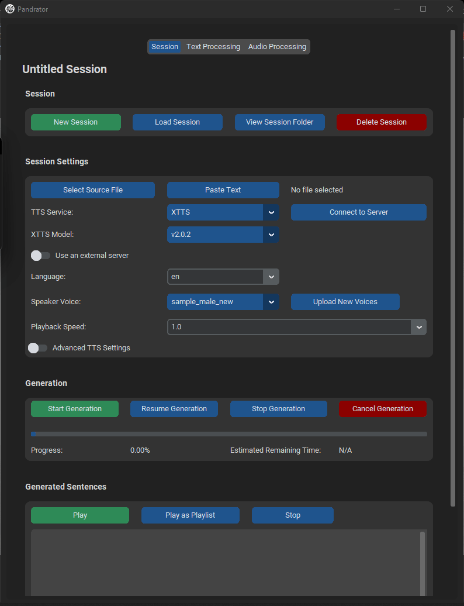

  

# Pandrator, a GUI audiobook and dubbing generator with voice cloning and AI text optimisation

>[!TIP]
>**TL;DR:** Pandrator has a GUI and works on Windows out of the box. With it, you can create audiobooks as well as dubbed video, including transcription and translation. The easiest way to use it is to download one of the precompiled [archives](https://1drv.ms/u/s!AgSiDu9lV3iMncwGlqV048WEFVNJTw?e=HfPvSb) - when you unzip them, use the launcher. They come in two versions, one with just XTTS and one with XTTS, RVC and WhisperX (WhisperX is needed for dubbing). You can also use the launcher to install additional tools (a different TTS engine, RVC or WhisperX). For other installation options, look below.

Pandrator aspires to be easy to use and install - it has a one-click installer and a graphical user interface. It is a tool designed to perform two tasks: 
- transform text, PDF, EPUB and SRT files into spoken audio in multiple languages based on open source software, including preprocessing to make the generated speech sound as natural as possible by, among other things, splitting the text into paragraphs, sentences and smaller logical text blocks (clauses), which the TTS models can process with minimal artifacts. Each sentence can be regenerated if the first attempt is not satisfacory. Voice cloning is possible for models that support it, and text can be additionally preprocessed using LLMs (to remove OCR artifacts or spell out things that the TTS models struggle with, like Roman numerals and abbreviations, for example),
- generate dubbing either directly from a video file, including transcription (using [WhisperX](https://github.com/m-bain/whisperX)), or from an .srt file. It includes a complete workflow from a video file to a dubbed video file with subtitles - including translation using a variety of APIs and techniques to improve the quality of translation. [Subdud](https://github.com/lukaszliniewicz/Subdub), a companion app developed for this purpose, can also be used on its own.  

It leverages the [XTTS](https://huggingface.co/coqui/XTTS-v2), [Silero](https://github.com/snakers4/silero-models) and [VoiceCraft](https://github.com/jasonppy/VoiceCraft) model(s) for text-to-speech conversion and voice cloning, enhanced by [RVC_CLI](https://github.com/blaisewf/rvc-cli) for quality improvement and better voice cloning results, and NISQA for audio quality evaluation. Additionally, it incorporates [Text Generation Webui's](https://github.com/oobabooga/text-generation-webui) API for local LLM-based text pre-processing, enabling a wide range of text manipulations before audio generation.

>[!NOTE]
> Please note that Pandrator is still in an alpha stage and I'm not an experienced developer (I'm a noob, in fact), so the code is far from perfect in terms of optimisation, features and reliability. Please keep this in mind and contribute, if you want to help me make it better.

- [Pandrator, an audiobook generator](#pandrator-an-audiobook-generator)
  - [Samples](#samples)
  - [Requirements](#requirements)
    - [Hardware](#hardware)
    - [Dependencies](#dependencies)
      - [Required](#required)
      - [Optional](#optional)
  - [Installation](#installation)
    - [Minimal One-Click Installation Executable (Windows with an Nvidia GPU only)](#installer-and-launcher)
    - [Manual Installation](#manual-installation)
  - [Features](#features)
  - [Quick Start Guide](#quick-start-guide)
    - [Basic Usage](#basic-usage)
    - [General Audio Settings](#general-audio-settings)
    - [General Text Pre-Processing Settings](#general-text-pre-processing-settings)
    - [LLM Pre-processing](#llm-preprocessing)
    - [RVC Quality Enhancement and Voice Cloning](#rvc-quality-enhancement-and-voice-cloning)
    - [NISQA TTS Evaluation](#nisqa-tts-evaluation)
  - [Contributing](#contributing)
  - [Tips](#tips)
  - [To-do](#to-do)

## Samples
The samples were generated using the minimal settings - no LLM text processing, RVC or TTS evaluation, and no sentences were regenerated. Both XTTS and Silero generations were faster than playback speed. 

https://github.com/user-attachments/assets/1c763c94-c66b-4c22-a698-6c4bcf3e875d

https://github.com/lukaszliniewicz/Pandrator/assets/75737665/bbb10512-79ed-43ea-bee3-e271b605580e

https://github.com/lukaszliniewicz/Pandrator/assets/75737665/118f5b9c-641b-4edd-8ef6-178dd924a883

Dubbing sample, including translation ([video source](https://www.youtube.com/watch?v=_SwUpU0E2Eg&t=61s&pp=ygUn0LLRi9GB0YLRg9C_0LvQtdC90LjQtSDQu9C10LPQsNGB0L7QstCw)):

https://github.com/user-attachments/assets/1ba8068d-986e-4dec-a162-3b7cc49052f4

## Requirements

### Hardware
#### XTTS
It's likely that you will need at least 16GB of RAM, a reasonably modern CPU for CPU-only generation (which you can choose in the launcher), and ideally an NVIDIA GPU with 4 GB+ of VRAM for really good performance.
#### Silero
Silero runs on the CPU. It should perform well on almost all reasonably modern systems. 
#### VoiceCraft
You can run VoiceCraft on a cpu, but generation will be very slow. To achieve meaningful acceleration with a GPU (Nvidia), you need one with at least 8GB of VRAM. If you have only 4GB, disable kv cache in advanced settings. 

### Dependencies
This project relies on several APIs and services (running locally) and libraries, notably:

#### Required
- [XTTS API Server by daswer123](https://github.com/daswer123/xtts-api-server.git) for Text-to-Speech (TTS) generation using Coqui [XTTSv2](https://huggingface.co/coqui/XTTS-v2) OR [Silero API Server by ouoertheo](https://github.com/ouoertheo/silero-api-server) for TTS generaton using the [Silero models](https://github.com/snakers4/silero-models) OR [VoiceCraft by jasonppy](https://github.com/jasonppy/VoiceCraft). XTTS and VoiceCraft perform best on a GPU (Nvidia), though can work on a CPU (especially XTTS), and Silero uses only the CPU. Silero can be run on low-end systems.
- [FFmpeg](https://github.com/FFmpeg/FFmpeg) for audio encoding.
- [Sentence Splitter by mediacloud](https://github.com/mediacloud/sentence-splitter) for splitting `.txt ` files into sentences, [customtkinter by TomSchimansky](https://github.com/TomSchimansky/CustomTkinter), [num2words by savoirfairelinux](https://github.com/savoirfairelinux/num2words) for converting numbers to words (Silero requirs this), `pysrt`, `pydub` and others (see `requirements.txt`). 

#### Optional
- [Text Generation Webui API by oobabooga](https://github.com/oobabooga/text-generation-webui.git) for LLM-based text pre-processing.
- [RVC_CLI by blaise-tk](https://github.com/blaise-tk/RVC_CLI.git) for enhancing voice quality and cloning results with [Retrieval Based Voice Conversion](https://github.com/RVC-Project/Retrieval-based-Voice-Conversion-WebUI).
- [NISQA by gabrielmittag](https://github.com/gabrielmittag/NISQA.git) for evaluating TTS generations (using the [FastAPI implementation](https://github.com/lukaszliniewicz/NISQA-API)).

## Installation

### GUI Installer and Launcher (Windows)
Run `pandrator_installer_launcher.exe` with administrator priviliges. You will find it under [Releases](https://github.com/lukaszliniewicz/Pandrator/releases). The executable was created using [pyinstaller](https://github.com/pyinstaller/pyinstaller) from `pandrator_installer_launcher.py` in the repository.

**The file may be flagged as a threat by antivirus software, so you may have to add it as an exception.**

You can choose which TTS engines to install and whether to install the software that enabled RVC voice cloning (RVC_CLI). You may install new components later. The installer creates the Pandrator folder, installs `winget`, `git`, `ffmpeg`, `C++ Build Tools` and/or `Calibre` if not installed already and `Miniconda`, clones the XTTS Api Server respository, the Silero Api Server repository or the VoiceCraft API repository and the Pandrator repository, creates conda environments, installs dependencies and launches Pandrator and the server you chose. **You may use the the Installer/Launcher to launch Pandrator and all the tools later**. 

If you want to perform the setup again, remove the Pandrator folder it created. Please allow at least a couple of minutes for the initial setup process to download models and install dependencies. Depending on the options you've chosen, it may take up to 25 minutes.

For additional functionality not yet included in the installer:
- Install Text Generation Webui and remember to enable the API (add `--api` to `CMD_FLAGS.txt` in the main directory of the Webui before starting it).
- Set up NISQA API for automatic evaluation of generations.

Please refer to the repositories linked under [Dependencies](#Dependencies) for detailed installation instructions. Remember that the APIs must be running to make use of the functionalities they offer.

### Manual Installation:
1. Make sure that Python 3, git, calibre and ffmpeg are installed and in PATH.
2. Install and run at least XTTS API Server, Silero API Server or VoiceCraft API Server. 
3. Clone this repository (`git clone https://github.com/lukaszliniewicz/Pandrator.git`).
4. `cd` to the repository directory.
5. Install requirements using `pip install -r requirements.txt`.
6. Run `python pandrator.py`.

## Features
- **Text Pre-processing:** Splits text into sentences and (attempts to) preserve paragraphs. Profiles for multiple languages are available.
- **LLM Text Pre-processing:** Utilizes a local LLM for text corrections and enhancements with up to three different prompts run sequentially, and an evaluation mechanism that asks the model to perform a task twice and then choose the better response. I've been using `openchat-3.5-0106.Q5_K_M.gguf` with good results, as well as for example `Mistral 7B Instruct 0.2`. Different models may perform different tasks well, so it's possible to choose a specific model for a specific prompt.
- **Audio Generation:** Converts processed text into speech, with options for voice cloning and quality enhancement. It currently supports `.txt`,  `.srt` and `.pdf` files. 
- **Audio Evaluation:** An experimental feature that predicts Mean Opinion Score (MOS) for generated sentences and sets a score threshold or chooses the best score from a set number of generations.
- **Generating and adding dubbing to video files:** Speech generated from subtitle files is synchronized with the SRT timestamps and can be saved as a file or mixed with an audio track of a video file, effectively producing dubbing. It handles cases where generated speech exceeds the time alloted for a subtitle and self-corrects synchronisation. It's possible to speed up or slow down generated audio. 
- **Session Management:** Supports creating, deleting, and loading sessions for organized workflow.
- **GUI:** Built with customtkinker for a user-friendly experience.

## Quick Start Guide
### Basic Usage
If you don't want to use the additional functionalities, you have everything you need in the **Session tab**. 

1. Either create a new session or load an existing one (select a folder in `Outputs` to do that).
2. Choose your `.txt`, `.srt`, `.pdf` or `epub` file. If you choose a PDF or EPUB file, a preview window will open with the extracted text. You may edit it (OCRed books often have poorly recognized text from the title page, for example). Files that contain a lot of text, regardless of format, can take a long time to finish preprocessing before generation begins. The GUI will freeze, but as long as there is processor activity, it's simply working. For whole books, expect 10m+ for preprocessing.
3. Select the TTS server you want to use - XTTS, Silero or VoiceCraft - and the language from the dropdown (VoiceCraft currently supports only English).
4. Choose the voice you want to use.
   1. **XTTS**, voices are short, 6-12s `.wav` files (22050hz sample rate, mono) stored in the `tts_voices` directory. The XTTS model uses the audio to clone the voice. It doesn't matter what language the sample is in, you will be able to generate speech in all supported languages, but the quality will be best if you provide a sample in your target language. You may use the sample one in the repository or upload your own. Please make sure that the audio is between 6 and 12s, mono, and the sample rate is 22050hz. You may use a tool like Audacity to prepare the files. The less noise, the better. You may use a tool like [Resemble AI](https://github.com/resemble-ai/resemble-enhance) for denoising and/or enhancement of your samples on [Hugging Face](https://huggingface.co/spaces/ResembleAI/resemble-enhance).
   2. **Silero** offers a number of voices for each language it supports. It doesn't support voice cloning. Simply select a voice from the dropdown after choosing the language.
   3. **VoiceCraft** works similarly to XTTS in that it clones the voice from a `.wav ` sample. However, it needs both a properly formatted `.wav` file (mono, 16000hz) and a `.txt` file with the transcription of what is said in the sample. The files must have the same name (apart from the extension, of course). You need to upload them to `tts_voices/VoiceCraft` and you will be able to select them in the GUI. Currently only English is supported. If you generate with a new voice for the first time, the server will perform the alignment procedure, so the first sentence will be generated with a delay. This won't happen when you use that voice again.
6. If you want, you can either slow down or speed up the generated audio (type in or choose a ratio, e.g. 1.1, which is 10% faster than generated; it may be especially useful for dubbing).
7. If you chose an `.srt` file, you will be given the option to select a video file and one of its audio tracks to mix with the synchronized output, as well as weather you want to lower the volume of the original audio when subtitle audio is playing.
8. Start the generation. You may stop and resume it later, or close the programme and load the session later.
9. You can play back the generated sentences, also as a playlist, edit them (the text for regeneration), regenerate or remove individual ones.
10. "Save Output" concatenates the sentences generated so far an encodes them as one file (default is `.opus` at 64k bitrate; you may change it in the Audio tab to `.wav` or `.mp3`).

### General Audio Settings
1. You can change the lenght of silence appended to the end of sentences and paragraphs.
2. You can enable a fade-in and -out effect and set the duration.
3. You can choose the output format and bitrate.

### General Text Pre-Processing Settings
1. You can disable/enable splitting long sentences and set the max lenght a text fragment sent for TTS generation may have (enabled by default; it tries to split sentences whose lenght exceeds the max lenght value; it looks for punctuation marks (, ; : -) and chooses the one closest to the midpoint of the sentence; if there are no punctuation marks, it looks for conjunctions like "and"); it performs this operation twice as some sentence fragments may still be too long after just one split.
2. You can disable/enable appending short sentences (to preceding or following sentences; disabled by default, may perhaps improve the flow as the lenght of text fragments sent to the model is more uniform).
3. Remove diacritics (useful when generating a text that contains many foreign words or transliterations from foreign alphabets, e.g. Japanese). Do not enable this if you generate in a language that needs diacritics, like German or Polish! The pronounciation will be wrong then.

### LLM Pre-processing
- Enable LLM processing to use language models for preprocessing the text before sending it to the TTS API. For example, you may ask the LLM to remove OCR artifacts, spell out abbreviations, correct punctuation etc.
- You can define up to three prompts for text optimization. Each prompt is sent to the LLM API separately, and the output of the last prompt is used for TTS generation.
- For each prompt, you can enable/disable it, set the prompt text, choose the LLM model to use, and enable/disable evaluation (if enabled, the LLM API will be called twice for each prompt, and then again for the model to choose the better result).
- Load the available LLM models using the "Load LLM Models" button in the Session tab.

### RVC Quality Enhancement and Voice Cloning
- Enable RVC to enhance the generated audio quality and apply voice cloning.
- Select the RVC model file (.pth) and the corresponding index file using the "Select RVC Model" and "Select RVC Index" buttons in the Audio Processing tab.
- When RVC is enabled, the generated audio will be processed using the selected RVC model and index before being saved.

### NISQA TTS Evaluation
- Enable TTS evaluation to assess the quality of the generated audio using the NISQA (Non-Intrusive Speech Quality Assessment) model.
- Set the target MOS (Mean Opinion Score) value and the maximum number of attempts for each sentence.
- When TTS evaluation is enabled, the generated audio will be evaluated using the NISQA model, and the best audio (based on the MOS score) will be chosen for each sentence.
- If the target MOS value is not reached within the maximum number of attempts, the best audio generated so far will be used.

## Contributing
Contributions, suggestions for improvements, and bug reports are most welcome!

## Tips
- You can find a collection of voice sample for example [here](https://aiartes.com/voiceai). They are intended for use with ElevenLabs, so you will need to pick an 8-12s fragment and save it as 22050khz mono `.wav` usuing Audacity, for instance.
- You can find a collection of RVC models for example [here](https://voice-models.com/).

## To-do
- [ ] Add support for chapter segmentation
- [ ] Add support for Surya for PDF OCR, layout and redeaing order detection, plus preprocessing of chapters, headers, footers, footnotes and tables. 
- [ ] Add support for StyleTTS2
- [ ] Add importing/exporting settings.
- [ ] Add support for proprietary APIs for text pre-processing and TTS generation.
- [ ] Include OCR for PDFs.
- [ ] Add support for a higher quality local TTS model, Tortoise.
- [ ] Add option to record a voice sample and use it for TTS to the GUI.
- [x] Add all API servers to the setup script.
- [x] Add support for custom XTTS models 
- [x] Add workflow to create dubbing from `.srt` subtitle files.
- [x] Include support for PDF files.
- [x] Integrate editing capabilities for processed sentences within the UI.
- [x] Add support for a lower quality but faster local TTS model that can easily run on CPU, e.g. Silero or Piper.
- [x] Add support for EPUB.

