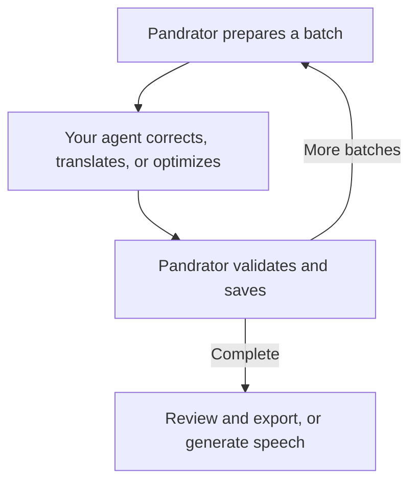

<p align="center">
  
</p>

# Pandrator

**Make audiobooks, subtitles, and voiceovers in one workspace.**

Turn a book into something you can listen to. Transcribe a recording, translate
its subtitles, or give it a new voice. Pandrator brings the steps together in a
browser interface, with room to review and refine the result as you go.

Run speech and transcription models on your own computer, connect a cloud
provider, or let your AI assistant help through MCP. Start with one workflow
and add more when you need them.

[](https://github.com/lukaszliniewicz/Pandrator/releases/download/v.0.9.0/PandratorManager-0.9.20-windows-x86_64.exe)
[](https://github.com/lukaszliniewicz/Pandrator/releases/download/v.0.9.0/PandratorManager-0.9.20-x86_64.AppImage)

Windows 10/11 and Linux desktop · x86-64 · Pandrator 0.9.0 / Manager 0.9.20

[All downloads & release notes](https://github.com/lukaszliniewicz/Pandrator/releases/latest)
· [Installation help](docs/getting-started/installation.md)
· [User guides](docs/README.md)

## Try your first workflow

1. **Download and run Pandrator Manager.** On Linux, make the AppImage
   executable first. Choose a parent folder; the Manager creates a `Pandrator`
   workspace inside it and opens the setup interface in your browser.
2. **Install Pandrator and the engine you need.** Try **Kokoro** for ready-made
   narration voices, or **CrispASR** for transcription. You can add voice
   cloning and other engines later. Docker, WSL, and a separate Python
   installation are not required.
3. **Make something small.** Choose **Generate an audiobook** and paste a
   short passage, or open **Quick Transcribe** to upload a clip or record your
   microphone. Listen, review, and save the result.

Local models download separately on first setup; speed and memory requirements
vary by engine and hardware. The Manager shows the available compute options.
The Windows launcher is currently unsigned, so Windows may show an unknown
publisher warning; the [installation guide](docs/getting-started/installation.md)
explains this and the release checksums.

## What would you like to make?

| Start with… | Make… | Guide |
| --- | --- | --- |
| A book, document, or pasted text | Narrated audio or an M4B audiobook with chapters and cover art | [First audiobook](docs/getting-started/first-audiobook.md) |
| An audio/video file or existing subtitles | Reviewed, corrected, or translated subtitles | [First subtitles](docs/getting-started/first-subtitles.md) |
| A video or subtitle file | Synchronized speech and a dubbed video | [First voiceover](docs/getting-started/first-voiceover.md) |
| A recording and optional captions | Transcript-guided cuts, reviewed boundaries, and an edited video | [Recording editing with MCP](pandrator_mcp/guides/workflows.md#media-editing) |
| A short clip or your microphone | A TXT, SRT, or JSON transcript without creating a session | [Quick Transcribe](docs/reference/quick-transcription.md) |

## Use the AI assistant you already have

If you use **Codex, Claude Code, OpenCode, or another MCP-capable host**, its
model can do Pandrator's language work directly. You do not need to configure
a separate LLM provider or API key in Pandrator for this route.

This is the **in-harness passive MCP workflow**: Pandrator prepares and tracks
the work; the model in your existing conversation processes it and submits
results through MCP. “Passive” describes Pandrator's role: it does not make the
LLM calls itself.


```mermaid
flowchart TD
    P["Pandrator prepares a batch"] --> A["Your agent corrects, translates, or optimizes"]
    A --> V["Pandrator validates and saves"]
    V -->|More batches| P
    V -->|Complete| R["Review and export, or generate speech"]
```

Use it to:

- **Clean PDF/EPUB text** before audiobook preparation, with reviewable changes
  to document structure and extraction artifacts.
- **Correct and translate subtitles**, keeping cue identities and shared
  terminology across batches.
- **Optimize text for speech** before narration, while retaining the source
  wording as a separate artifact.
- **Coordinate a whole workflow**: import a file, process the text, select a
  voice, generate speech, and return verified deliverables.

After [connecting your MCP host](docs/operations/agent-connections.md), try a
request such as:

> Use Pandrator to correct this recording's English subtitles and translate
> them into Polish. Use your own model through passive dispatch, keep a shared
> glossary, and export both SRT files. Preserve uncertain wording for review.

Pandrator tracks batches, validates submissions, and keeps completed work so
an interrupted agent can resume. The agent must continue the tool loop;
starting a passive run alone does not process it. Speech recognition and
speech generation still use the engines you select in Pandrator.

Your host's normal usage limits and costs apply. If its model runs in the
cloud, the text it processes is sent there, even when Pandrator runs locally.

See the [passive workflow guide](docs/guides/passive-dispatch.md),
[end-to-end agent guide](docs/guides/agent-workflows.md), and the
[reusable workflow skill](pandrator_mcp/skills/pandrator-workflows/SKILL.md).
The skill adds workflow guidance; the MCP connection supplies the tools.
See [skill installation](pandrator_mcp/README.md#optional-workflow-skill) to add it
to your host.

## Features in more detail

### Audiobooks and narration

- Import TXT, PDF, EPUB, DOCX, MOBI, or pasted text. MOBI conversion needs
  optional Calibre.
- Prepare documents with extraction, OCR, chapter detection, text cleanup,
  and optional AI assistance.
- Adjust pronunciation and speech text, generate in segments, compare takes,
  and regenerate selected passages.
- Record or upload voice references and retain their transcripts.
- Export WAV, MP3, Opus, FLAC, or M4B, with audiobook chapters, metadata,
  and cover art where the format supports them.

### Subtitles, voiceovers, and recording edits

- Transcribe audio/video with timestamps and optional speaker diarization.
- Import SRT; WebVTT, ASS, and SSA uploads are also recognized, with SRT used
  as the working subtitle format.
- Correct, translate, split, merge, and retime cues in a reviewable editor.
  Use manual edits, configured language providers, or passive MCP processing.
- Generate synchronized speech and export media with selectable audio and
  subtitle tracks, including burned-in subtitles.
- Plan recording cuts from a transcript, inspect and refine their boundaries,
  and render a reviewed edit while preserving the original media.

### Quick transcription and automation

- Upload audio/video or record and preview your microphone, then copy or
  download TXT, SRT, or JSON without creating a permanent session.
- Transcribe through HTTP or MCP: an approved-root file path or a small
  base64-encoded clip can be supplied through MCP. Larger files are streamed
  from the host rather than placed in the model's context.
- Quick transcripts are temporary and expire one hour after completion;
  save the result you want to keep.
- Use MCP for session workflows, live voice/model selection, reviewable plans,
  resumable work, and downloads verified by size and checksum.

## Models and providers

### Local speech generation

**audio.cpp is a local speech provider with several models to choose from,
and the default for new workspaces.** Select the model packages you want to
install in the Manager, then choose an installed model in **Generate audio**
settings. You can switch models or add more later. Available families include:

| audio.cpp model family | Voice options |
| --- | --- |
| **Qwen3 TTS 1.7B** | Base for reference-voice cloning; CustomVoice for built-in speakers. |
| **Fish Audio S2 Pro** | Expressive reference-voice cloning. |
| **VoxCPM2** | Multilingual reference-voice cloning. |
| **Chatterbox** | Reference-voice cloning. |
| **MagpieTTS** | Preset multilingual voices. |
| **OmniVoice** | Multilingual reference-voice cloning. |
| **PocketTTS English** | English speech generation. |
| **FireRedTTS3 Base** | Experimental multilingual reference-voice cloning. |
| **BreezeTTS 2** | Instruction-based voice design and optional reference cloning. |

The Manager supplies selectable Q8_0 model packages. CPU, Vulkan, and CUDA
builds are available; the Linux CUDA build is currently best-effort and has not
been verified on NVIDIA hardware. Available voices and languages depend on the
selected model.

These dedicated providers also remain available:

| Provider | Voice options and capabilities |
| --- | --- |
| **Kokoro-82M v1.0** | Lightweight, CPU-friendly preset voices; a useful first narration engine. |
| **Silero** | CPU-friendly language-specific voice packs; licence terms differ by pack. |
| **XTTS v2** | Multilingual and cross-language voice cloning; import fine-tuned model bundles or use the optional XTTS training component. |
| **Voxtral** | Preset voices; requires a supported GPU/WGPU backend. |

Existing workspaces keep their saved defaults and provider selections.
Standalone Qwen3 TTS, Fish S2 Pro, VoxCPM2, Chatterbox, and Magpie providers
remain supported for compatibility. Installed components stay manageable;
uninstalled ones appear under **Compatibility backends**. In a saved session,
**Switch to audio.cpp** proposes a matching model family for review. Voices and
engine settings are not assumed interchangeable, and existing takes remain
intact. See [switching providers](docs/guides/providers-and-voices.md#switching-from-a-compatibility-provider).

Optional **RVC** converts the voice of generated audio, keeping the original
and converted takes available. It is a separate post-processing step.
XTTS training benefits strongly from an NVIDIA GPU.

### Transcription and alignment

| Runtime / provider | Models and capabilities |
| --- | --- |
| **CrispASR (local)** | **Whisper large-v3** for multilingual transcription, **Parakeet TDT 0.6B v3** with native word timing, and **MOSS Transcribe-Diarize 0.9B** with speaker diarization. |
| **Canary CTC (local)** | Forced alignment for existing captions and MOSS word timing; aligns text to audio. |
| **Azure Speech (cloud)** | **MAI-Transcribe-2** and **MAI-Transcribe-1.5**, with word timing; these profiles do not provide diarization. |

### Cloud speech and external servers

- **OpenAI:** `gpt-4o-mini-tts`, `tts-1`, and `tts-1-hd`.
- **Google Gemini / Vertex AI:** Gemini 3.1 Flash TTS Preview, 2.5 Flash TTS,
  and 2.5 Pro TTS.
- **ElevenLabs:** native API integration with live model and voice discovery.
- **Azure Speech:** MAI Voice 2 and MAI Voice 2 Flash preset voices.
- **External servers:** OpenAI-compatible and generic JSON endpoints, with
  profiles for services such as Piper, StyleTTS2, Matcha-TTS, and
  Open Unified TTS, plus Azure OpenAI TTS deployments. These are connections
  to separately operated services; they are not all Manager-installable engines.

Cloud access depends on your provider account and available models.

### Language models and translation

Use **OpenAI, Anthropic, Google Gemini, OpenRouter, Groq, Mistral AI,
Azure OpenAI, Google Vertex AI, or Amazon Bedrock**, or connect a local
**LM Studio, Ollama, or OpenAI-compatible server**. Model selection follows
the provider's catalogue or your configured model ID.

Correction, glossary-aware translation, document cleanup, and speech-text
optimization can use a configured LLM. **DeepL** is also available for
translation. The passive MCP route above lets your existing host model do
language work instead.

The [providers and voices guide](docs/guides/providers-and-voices.md) covers
setup, compute choices, voice references, and model imports.

## Your computer, your choice of providers

Local speech and transcription engines can keep processing on your own
machine. Cloud speech, language, and translation services are optional; their
selected inputs are sent to those providers. Model language coverage, hardware
requirements, and licences differ. Check the engine's details before a long run.

Pandrator is designed for one owner and listens locally by default. You can
also run it on a home server or GPU host; follow the
[remote and headless guide](docs/operations/remote-and-headless.md) for setup
and the [privacy guide](docs/security/privacy-and-security.md) for data flows.

## Go further

| Topic | Documentation |
| --- | --- |
| Setup and step-by-step workflows | [Documentation index](docs/README.md) |
| Engines, voice references, and model imports | [Providers and voices](docs/guides/providers-and-voices.md) |
| PDF/EPUB extraction and cleanup | [Document ingestion](docs/reference/document-ingestion.md) |
| Correction, translation, and glossaries | [Language workflows](docs/guides/correction-and-translation.md) |
| Pronunciation and narration preparation | [Pronunciation](docs/guides/pronunciation-and-speech.md) · [Speech optimization](docs/reference/speech-optimization.md) |
| Supported output formats | [Formats and exports](docs/reference/formats-and-exports.md) |
| Installation, updates, and repair | [Manager guide](pandrator_manager/README.md) |
| MCP connection and workflow skill setup | [MCP guide](pandrator_mcp/README.md) |

## Development

For source development, install [Pixi](https://pixi.sh/) and use the committed
lockfile:

```bash
git clone https://github.com/lukaszliniewicz/Pandrator.git
cd Pandrator
pixi install --locked
pixi install --environment web-build --locked
pixi run --environment web-build web-build
pixi run serve-web
```

Run `pixi run run-worker` in a second terminal. See
[development from source](docs/development/from-source.md) and
[contributing](docs/development/contributing.md) for the development workflow
and focused checks.

## Help and feedback

Stuck on setup? Start with [troubleshooting](docs/operations/troubleshooting.md).
Found a bug or have an idea? [Open an issue](https://github.com/lukaszliniewicz/Pandrator/issues)
with your operating system, engine/provider, and steps to reproduce it. For
installation or service failures, the Manager's **Download diagnostics** bundle
can help; inspect it before sharing.

## License

Pandrator's source code is available under the [MIT License](LICENSE).
Third-party models, dependencies, and providers have their own licences and
usage terms. Check those separately, and use source media and voice references
you have the rights to use.
