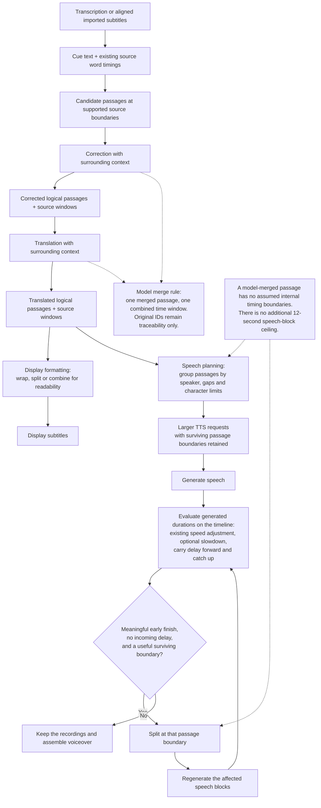

# Voiceover pipeline with preserved logical passages

This describes the logical-passage pipeline implemented in the development
checkout. It uses existing source timing evidence and adds no alignment pass
over generated speech.

Correction and translation are optional workflow stages; when skipped, the
available passages continue to the next enabled stage. A passage's window locates
the corresponding source content. It is not a target duration the generated
speech must fill. Display subdivisions never become new speech repair anchors.

The existing early-repair pass still estimates internal advance from total audio
duration and text proportions. It does not measure generated word timings, and
it does not extend pauses inside an existing recording.
