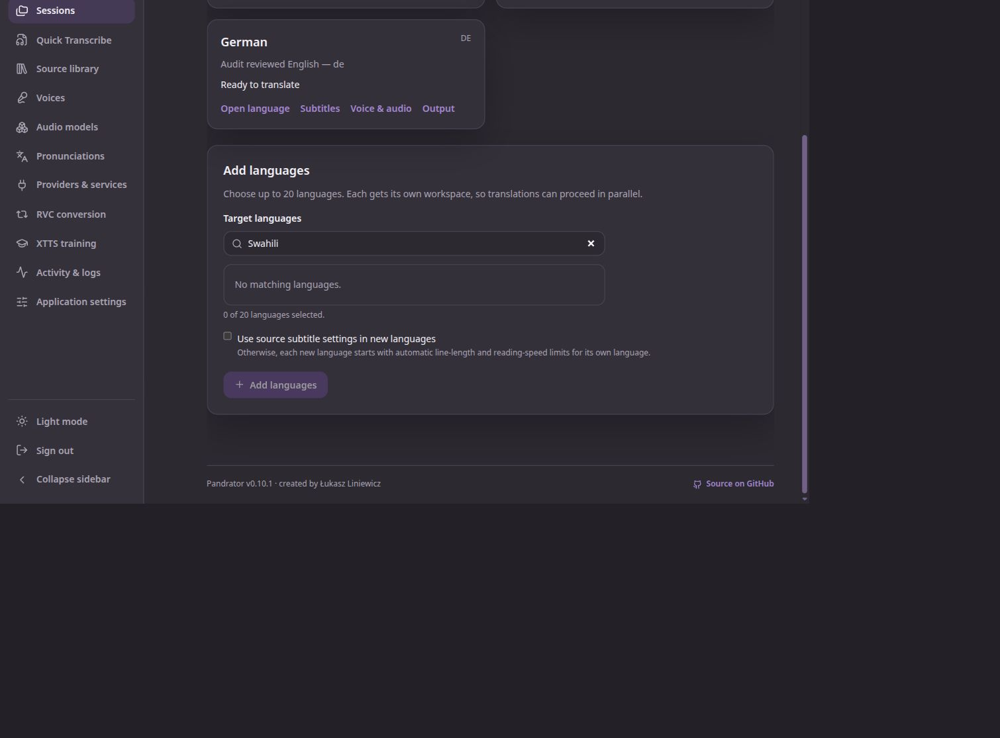

# Language, ASR routing and preprocessing audit — 2 October 2026

**The current language list does not cover all supported model languages, and expanding the picker alone would leave incorrect capability claims in place.** The UI has 50 concrete choices. Swahili, Burmese, Khmer and Lao are absent despite VoxCPM2 support; many Silero CIS/Indic languages are also absent. Backend catalogue metadata sometimes advertises languages for the wrong variant or uses coverage prose as if it were a language code.

This is an extension of the [pre-release audit](2026-10-02-pre-release.md), requested during the audit. The [release plan](2026-10-02-release-plan.md) incorporates expanded language tracking, Parakeet-preferred ASR and Demucs. These changes are planned, not implemented by this review.

## Provenance and scope

Audited Pandrator commit: `ca14815d516a1e8e55d4b24ee8c26e0b89dd98f4`. Source tracing covered all 14 default TTS providers plus Azure compatibility profiles, the audio.cpp speech package projection, Silero live/static discovery, active local/cloud ASR and alignment, request normalization and the parent-owned picker/voice controls. Primary-source research checked exact upstream variants and code/model revisions; no weights were downloaded or inference run.

- audio.cpp runtime: **0.9.0**, upstream commit `795c45fbde0a7d29c93b22199728ff5caaec02e5`.
- Application and generated Manager inventories still identify as **0.8.1**, 86 families / 256 packages across all tasks. Current Manager projection offers 117 installable speech packages in 36 families; the application speech-catalogue projection has 127 entries in 37 families. Those are different projections, not a count of independently tested models.
- Most expanded weight packages pin `bd2f3e26c1a74fa359d712b4e46919fc244722c5` through `weight_manifest`; manual packages use `dc6fecccc2b0c6bdda0a8b2f38fa61394fee0b9c`. Binary version, inventory provenance and weight revision are separate identities.
- Official Silero registry research used `d9355348e2781dc8fa25a135d1602c530afae24c`; wrapper catalogue used `cfbdc09453d08d9abde093d31fa2ca1907d86c76`. Neither establishes the version of the user's installed service.

The static picker and the relevant audio.cpp catalogue projection are substantially unchanged from the 0.10.1 baseline. Their defects are current catalogue debt exposed by the expanded audit, not all newly introduced regressions. Subtitle evidence changed substantially in the release range; its Azure language mismatch is separately identified below.

## Confirmed current gaps

### 1. The global picker omits supported languages

Locations: `web/src/lib/settings-fields.ts:15`; `LanguagePicker.svelte:24`; wizard/workflow/voice-sample consumers of `LANGUAGE_OPTIONS`.

The list has 51 entries including `auto`, hence 50 concrete choices. The target-language picker has no alternate code-entry path. Searching **Swahili** in the Languages screen returned **No matching languages**; the [VoxCPM2 card](https://huggingface.co/openbmb/VoxCPM2) explicitly includes it, as well as Burmese, Khmer and Lao. Silero also supplies supported languages absent from the list, including Azerbaijani, Armenian, Belarusian, Georgian, Kazakh, Kyrgyz, Tajik, Tatar, Uzbek and several native Indic languages.

### 2. Exact model variants inherit incorrect family coverage

Location: `pandrator/logic/audio_cpp_catalogue.py:161`.

- SanoTTS German filtering returns all **18 packages**, because every package inherits the family's 14-language set. These are language-specific packages; only `sanotts_de_orig` is the German package. [Pinned native package table](https://raw.githubusercontent.com/0xShug0/audio.cpp/v0.9.0/docs/community_models/sanotts.md)
- Japanese filtering returns all **seven IndexTTS2-family packages**, including four original v2 variants. Original IndexTTS2 supports Chinese/English; the three 2.5 variants add Japanese/Spanish/Arabic. [Pinned variant guide](https://raw.githubusercontent.com/0xShug0/audio.cpp/v0.9.0/docs/models/index_tts.md)
- VoxCPM1 0.5B advertises Japanese/Korean locally, but the [exact official card](https://huggingface.co/openbmb/VoxCPM-0.5B) establishes Chinese/English. The additional languages remain unverified for that package.

Pure request probes also showed `_audio_cpp_language('sanotts_de_orig','ja')` and `_audio_cpp_language('index_tts2_q8_0','ja')` forwarding `ja`. Metadata and preflight need to agree before submitting those requests. No live wrong-language synthesis was attempted.

### 3. Coverage descriptions are treated as language identifiers

Examples in `audio_cpp_inventory.json`: Fish `80+ languages`, Higgs `100+ languages`, OmniVoice `600+ languages`, DotTTS `multilingual`. The catalogue's exact-code filter at `audio_cpp_catalogue.py:344` therefore returns zero Fish/OmniVoice models for English. A one-element prose array also prevents the intended multilingual capability classification.

The frontend `voice-catalog.ts:411–477` prefers a nonempty model language array and returns its strings as selectable values, without distinguishing codes from coverage notes. That makes the metadata problem capable of reaching speech-language controls as unusable prose options.

Exact lists can be recovered for major families: Fish has 83 published metadata codes; OmniVoice has a 646-entry official mapping. Higgs has 102 named languages requiring a reviewed code mapping. DotTTS's 24-language benchmark is a documented evaluated subset, not an exhaustive trained-support list. See the source table below.

### 4. Language/locale normalization is inconsistent across layers

- Qwen catalogue filtering returns ten packages for `zh`, zero for `zh-CN`, although its request conversion handles Chinese regional tags.
- Neutral Kokoro filtering returns four for `en`, zero for `en-US`; the request path also collapses `en-GB` to `en`. The acoustic consequence of that collapse was not tested.
- Silero normalizes `uk` to `ukr`, but leaves `uk-UA` as `uk-ua` and `en-US` as `en-us` (`tts_handler.py:5454`). Actual installed-server acceptance of those regional forms remains untested.
- Subtitle evidence's generic ASR normalizer converts Norwegian `nb` to `no`, then tests that against Azure's locale list. The probe returned `_language_supported('azure_mai_transcribe_2','nb') == False`, while actual Azure request construction accepted it and emitted `locales=['nb']` (`subtitle_evidence.py:134`; `cloud_stt.py:600`).

Normalize a canonical language/locale once, then use an explicit provider/operation mapping. Preserve regional distinctions where the model or voice needs them.

### 5. Static and live provider coverage must not be conflated

`model_catalogue.py:398` records empty static languages for all Silero variants, VoxCPM2, Chatterbox variants, OpenAI, Gemini, Vertex and ElevenLabs defaults. Empty here means unrecorded support. For example, the static Silero catalogue returns zero models for an English filter.

Silero's live adapter (`tts_providers.py:1193`) does preserve server model languages, per-voice language and defaults-by-language. ElevenLabs discovery also retains live model language descriptors. Keep that useful dynamic metadata and identify its provenance; supply accurate offline metadata without presenting unknown coverage as a universal list.

Fish's non-audio.cpp fallback currently copies XTTS's 17-code table (`constants.py:55`), despite a much broader documented Fish model. The code path omits a language field and infers language from text; request shape is distinct from actual model coverage.

## TTS evidence by exact family/route

Lists below describe documented support or current tracking, not equal acoustic quality. A native adapter may support fewer languages than a model checkpoint.

| Model/route | Evidence and required distinction |
| --- | --- |
| Qwen3-TTS Base / CustomVoice / VoiceDesign | Ten: `zh en ja ko de fr ru pt es it`; voice modes differ. These are TTS languages, separate from Qwen ASR/alignment. [Official card](https://huggingface.co/Qwen/Qwen3-TTS-12Hz-1.7B-Base) |
| Breeze-TTS-2 | Chinese/English. [Official card](https://huggingface.co/BreezeBlue/Breeze-TTS-2) |
| audio.cpp Chatterbox | Pinned native route lists 19 codes, including Swahili. Newer upstream Multilingual V3's 23-language claim must not expand older GGUFs automatically. [Native route](https://github.com/0xShug0/audio.cpp/blob/795c45fbde0a7d29c93b22199728ff5caaec02e5/docs/tts.md#chatterbox) |
| Chatterbox Turbo | English only; distinct native family/voice capabilities. [Native guide](https://github.com/0xShug0/audio.cpp/blob/795c45fbde0a7d29c93b22199728ff5caaec02e5/docs/community_models/chatterbox_turbo.md) |
| audio.cpp Magpie | 13 language/locale tags; Japanese frontend intentionally not ported despite checkpoint support. [Native guide](https://github.com/0xShug0/audio.cpp/blob/795c45fbde0a7d29c93b22199728ff5caaec02e5/docs/models/magpie_tts.md) |
| PocketTTS | Enabled packages: English/German/Italian/Portuguese/Spanish. Language is chosen at model load; French preview is a different, unenabled package. [Native guide](https://github.com/0xShug0/audio.cpp/blob/795c45fbde0a7d29c93b22199728ff5caaec02e5/docs/tts.md#pockettts) |
| IndexTTS2 / 2.5; SanoTTS; VoxCPM1 | Variant-specific corrections described above |
| VoxCPM2 | 30 languages including `my km lo sw`; text-driven selection. [Official card](https://huggingface.co/openbmb/VoxCPM2) |
| FireRedTTS3 | 24 languages plus Chinese dialects; Base cloning versus Instruct design/editing. Text normalization also has route-specific limits. [Official card](https://huggingface.co/FireRedTeam/FireRedTTS3) |
| Supertonic 3 | 31 named official languages; native special token `na` remains unresolved rather than a 32nd natural language. [Official card](https://huggingface.co/Supertone/supertonic-3) |
| Kokoro | Locale/voice-specific English, French, Portuguese and other support; voice prefix matters. [Native map](https://github.com/0xShug0/audio.cpp/blob/795c45fbde0a7d29c93b22199728ff5caaec02e5/docs/models/kokoro_tts.md) |
| CosyVoice3 | Nine common languages plus dialect support; native route explicitly names Cantonese. [Official card](https://huggingface.co/FunAudioLLM/Fun-CosyVoice3-0.5B-2512) |
| Fish S2 Pro | **83 unique codes** in [pinned model-card YAML](https://huggingface.co/fishaudio/s2-pro/blob/1de9996b6be38b745688de084d87a5633f714e4e/README.md). Metadata/prose differ for `jw` and `sl`/`xsl`; preserve source discrepancy and normalize reviewed aliases. |
| OmniVoice | **646 IDs/names**, matching pinned model-card metadata and [first-party TSV](https://github.com/k2-fsa/OmniVoice/blob/08be0b4ccbac3e13e374e86fbfead4b4cac343e2/docs/lang_id_name_map.tsv). IDs mix two/three-letter codes; use its map instead of the prose placeholder. |
| Higgs TTS4B | **102 language names** in [pinned card](https://huggingface.co/bosonai/higgs-audio-v3-tts-4B/blob/239f63fb7b02b1aa085f98d9efae5e35cc5523e8/README.md); no exact identifier registry found in small configs. Requires reviewed name/code mapping. |
| DotTTS SOAR/MF | **24 evaluated languages**, no authoritative exhaustive list found. Accepted text tags alone do not establish trained support. [First-party benchmark](https://github.com/studio-dots-ai/dots.tts/blob/3cb6f94a571097b500038f1619959075282c5c98/README.md) |
| XTTS-v2 | Current catalogue records 17 codes; raw language goes to its request. No new acoustic verification here. |
| Native Voxtral / Magpie / Kokoro / Kobold Qwen | Current tracking has nine / nine / ten locale-bearing / ten language entries respectively. Native versus audio.cpp variants have different contracts; voice or text can select language without a universal language field. |
| Other enabled audio.cpp speech families | Mostly family-level metadata and generic language forwarding. Do not present these as per-variant independently verified language guarantees; curated evidence is needed where a support list is incomplete/ambiguous. |

Cloud providers are separate routes too:

| Provider/model | Official evidence / limit |
| --- | --- |
| OpenAI `gpt-4o-mini-tts`, `tts-1`, `tts-1-hd` | The [TTS guide](https://developers.openai.com/api/docs/guides/text-to-speech#supported-languages) lists 57 names for spoken output, with English-optimized voices. It provides no distinct per-model locale registry; retain that level of provenance rather than importing a separate ASR table. |
| Vertex Gemini 3.1 Flash preview / 2.5 Flash / 2.5 Pro TTS | Shared official family table has **87 BCP-47 locales**, 24 GA and 63 Preview. Preserve preview status. [Vertex documentation](https://docs.cloud.google.com/text-to-speech/docs/gemini-tts#available_languages) |
| Gemini API 3.1 / 2.5 TTS aliases | Exact API-specific lists were not established: the [current speech guide](https://ai.google.dev/gemini-api/docs/speech-generation#supported-languages) labels its language columns for Gemini 3.8. Transferring that or Vertex coverage to older API aliases would be inference. |
| ElevenLabs static `eleven_multilingual_v2` | Official model table lists **29 codes**; dynamically discovered models require their own API metadata. [Model documentation](https://elevenlabs.io/docs/overview/models#models-overview) |
| Azure MAI Voice profile | Current model descriptors expose voice-derived locales. Voice locale selects the SSML route; this is distinct from Azure MAI ASR. |

## Silero: model pack, voice and language

The [official registry/speaker tables](https://github.com/snakers4/silero-models/blob/d9355348e2781dc8fa25a135d1602c530afae24c/README.md#models-and-speakers) and [first-party wrapper catalogue](https://github.com/lukaszliniewicz/silero-fastapi/blob/cfbdc09453d08d9abde093d31fa2ca1907d86c76/src/silero_fastapi/catalog.py) distinguish these packs:

| Pack | Documented language scope |
| --- | --- |
| `v5_cis_base_nostress`, `v5_cis_base` | 20 CIS/regional language tokens; add missing canonical language aliases and labels |
| `v5_cis_ext` | Six: Kazakh, Kalmyk, Tatar, Uzbek, Ukrainian, Chuvash |
| `v5_5_ru` | Russian |
| `v3_en` | English |
| `v3_en_indic` | Indian English (`en-in` in wrapper); a voice named Tamil/Gujarati does not claim that native language |
| `v3_de`, `v3_es`, `v3_fr` | German, Spanish, French respectively |
| `v3_indic` | Bengali, Gujarati, Hindi, Kannada, Malayalam, Manipuri, Rajasthani, Tamil, Telugu |

The static Pandrator fallback omits `v5_cis_base`; live discovery can recover it. The base “nostress” pack still has stress requirements for Russian/Ukrainian/Belarusian; other pack requirements also vary. These need visible model/language metadata when presenting a voice, not assumptions from its display name.

Upstream's loader uses a speaker argument to identify a model pack, while synthesis uses a speaker to choose its voice. Pandrator's wrapper sends model/voice/language separately and validates pack membership. Keep that distinction; voice-profile sample language is evidence about a recording and is not the renderer's language capability.

## ASR and timing remain separate

Active transcription uses **CrispASR** for local Whisper/Parakeet/MOSS/Qwen. The audio.cpp task inventory is not the active ASR adapter-selection registry.

| Active engine | Recorded recognizer scope | Timing and availability |
| --- | --- | --- |
| Whisper large-v3 | 100 local codes | Native timed path; current default |
| Parakeet TDT 0.6B v3 | 25 European languages | Native timed path; model owns language selection |
| MOSS Transcribe-Diarize 0.9B | Exact coverage unknown | `None` means unrecorded, not universal |
| Qwen3 0.6B / 1.7B | 30 codes | Forced aligner 11; total configured timed path 20; explicit source language required |
| Azure MAI-Transcribe 1.5 / 2 | 43 / 60 profile locales | Provider-specific normalization, separate from TTS |

Sources in Pandrator: `stt_languages.py:14`, `crispasr.py:71`, `qwen_asr.py:86`, `stt_provider_profiles.py:27`. Qwen's native aligned set is `zh en yue fr de it ja ko pt ru es`; Canary adds `nl sv da fi pl cs el hu ro`. Arabic, Indonesian, Thai, Vietnamese, Turkish, Hindi, Malay, Filipino, Persian and Macedonian are recognizer-supported without the current timed route.

Current session transcription has no language-aware fallback. Missing/`auto` engine normalizes to Whisper. An unused availability helper tries Whisper first and ignores language; the voice-reference helper separately prefers Parakeet and falls back to Whisper. Those paths need one consistent policy for the requested default.

For today's timestamp-required flows, Qwen extends Parakeet chiefly with Chinese, Cantonese, Japanese and Korean. Qwen availability requires a usable CrispASR version and an appropriate recognition/alignment path; audio.cpp installation alone is insufficient. Runtime usability and cached weights are separate. The audit host's cheap probe found CrispASR unavailable; this does not establish the user's managed instance state.

There is an independent audio-LID primitive in pinned **CrispASR 0.8.40**: `crispasr_detect_language_pcm`, with code/confidence output and a 15-second sample cap. A multilingual Whisper Tiny detector-only CLI path also exists. Pandrator currently invokes neither independently. Unified `--lid-backend` performs detection followed by transcription; `crispasr-lid` is text identification. [Pinned API](https://github.com/CrispStrobe/CrispASR/blob/v0.8.40/include/crispasr_session.h#L324), [CLI early-return implementation](https://github.com/CrispStrobe/CrispASR/blob/v0.8.40/src/crispasr.cpp#L7953)

## Demucs and the compute claim

[audio.cpp 0.9.0](https://github.com/0xShug0/audio.cpp/releases/tag/v0.9.0) adds **six-stem HTDemucs**; four-stem HTDemucs is already in the older inventory. The current preprocessing allowlist supports only off / BS-RoFormer / Mel-Band RoFormer.

The existing `apply_vocal_isolation` → `isolate_vocals` path already normalizes to 44.1 kHz, invokes native separation, selects/validates vocals, preserves original media and duration, and uses cancellable owned execution. Demucs fits that junction. Native four-stem emits drums/bass/vocals/other; six-stem adds guitar/piano. It computes all configured stems; no independently established vocals-only native shortcut was found. [Native guide](https://github.com/0xShug0/audio.cpp/blob/v0.9.0/docs/audio_tools.md#htdemucs)

| Q8 model | Verified weight-file size |
| --- | ---: |
| Four-stem HTDemucs | 61,940,768 bytes |
| Six-stem HTDemucs | 42,477,600 bytes |
| BS-RoFormer | 172,532,256 bytes |
| Mel-Band RoFormer | 251,748,928 bytes |

Six-stem exists in a newer official GGUF revision, not the current manual weight pin. Its availability requires a deliberate catalogue/asset refresh. [Official six-stem metadata](https://huggingface.co/audio-cpp/audio.cpp-gguf/tree/7bf52723f5a95b6cec53ea905fd10eca1c8b942e/HTDemucs-6stems-GGUF)

**A smaller download is established; lower compute or peak memory is not.** Native Demucs retains whole-track/stem buffers, and six-stem CUDA uses an explicit-attention fallback. No comparable native Demucs/RoFormer wall-time/RAM/VRAM measurements were found. Official BS-RoFormer tests do show lower overlap reducing time on one RTX 3090 fixture, with a quality/blending tradeoff; that is a separate tuning result. [Upstream measurements](https://github.com/0xShug0/audio.cpp/blob/v0.9.0/tests/bs_roformer/README.md#cuda-optimization-validation)

## Verification and limits

Additional catalogue/provider tests: **67 passed**, plus **24 passed / 59 deselected** in the focused request-boundary selection. Pure probes established exact-filter and normalization results above. Parent source inspection and a browser search established the missing language. These supplement the core audit runs and must not be summed as globally unique coverage.

Primary-source/model/config research established declared support and pinned-route limits, not speech quality in every language. No real provider requests, installed Silero refresh, new model/runtime installation, separation benchmark or detector execution occurred. Unknown route coverage remains explicit. The release plan requires mechanical catalogue completeness checks and bounded real-route acceptance before advertising the expanded capabilities.
