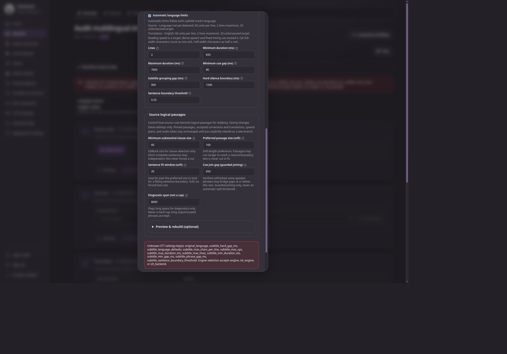

# Pandrator pre-release audit — 2 October 2026

This is the historical, pre-implementation audit. See the [implementation and acceptance record](2026-10-02-implementation-status.md) for repairs and current release status.

**Recommendation: hold the release.** The core review confirmed nine product defects through service/browser reproduction or isolated import execution, and the release test gates are failing. The additional requested language audit found current catalogue and normalization defects as well. The multilingual workflow is a useful addition and its basic UI paths worked, but several existing workflows now disagree with the new contracts.

The accompanying [release plan](2026-10-02-release-plan.md) includes the fixes and the related wishlist items proposed for the next release. This audit changes documentation and retains screenshots only; it does not implement fixes, publish packages, or activate a production runtime.

## Scope and baseline

| Item | Verified state |
| --- | --- |
| Last published GitHub release | [Pandrator 0.10.1](https://github.com/lukaszliniewicz/Pandrator/releases/tag/v.0.10.1), published 25 September 2026 at 02:43 UTC / 04:43 Warsaw |
| Baseline commit | `a82419b0e9a2289533e6de387f43eef614272dd5`, peeled from `v.0.10.1` |
| Audited commit | `ca14815d516a1e8e55d4b24ee8c26e0b89dd98f4`, clean `main`, also `origin/main` at the start of the audit |
| Range | 12 commits; 460 changed paths, including 249 bundled frontend assets and 26 frontend source/test paths |
| Source versions | Application 0.10.1; MCP 0.5.0; Manager 0.9.27 |
| Migration chain | New 0050 and 0051 revisions follow 0049 correctly; production upgrade execution was not attempted |

The review covered release history and packaging boundaries, session forks and purge, multilingual setup/projects, subtitle correction/translation/review, speech preparation and voice selection, generation identity, media/export selection and frozen tails, and Manager persistence/runtime changes. Source review was combined with focused tests, finding-specific reproductions, current CI logs, and parent-owned browser inspection. It is not exhaustive proof of every provider, operating system, codec, or line in the range.

## Confirmed product findings

Priorities describe impact: P1 is a broadly blocking regression; P2 is a material defect with a narrower trigger. All findings below should be resolved before this release.

### 1. P1 — Transcribe settings cannot be saved through the current UI

Locations: `web/src/lib/SessionWorkspace.svelte:2499`, `:2664`, `:2686`; `pandrator/web/settings_policy.py:675`.

The new STT whitelist rejects fields that the Transcribe dialog submits on every save. `captureStageSettings` includes `original_language` and ten `subtitle_*` values; `stageSectionUpdates` sends the entire object to the STT section even though it also writes a separate subtitles section. `persistSection` further merges previously stored overrides into that payload.

Browser reproduction: create a subtitles session, open Transcribe → Settings, leave defaults unchanged, and press **Save settings**. The dialog stays open with `Unknown STT settings key(s): original_language, subtitle_hard_gap_ms, subtitle_language_defaults, subtitle_max_chars_per_line, subtitle_max_cps, subtitle_max_duration_ms, subtitle_max_lines, subtitle_min_duration_ms, subtitle_min_gap_ms, subtitle_phrase_gap_ms, subtitle_sentence_boundary_threshold`. No ASR job is needed to trigger it.

This also explains actual failures in the local-transcription browser tests and prevents the source-passage conflict test from reaching its intended write. Fix the UI's section-specific payloads and normalize recognized legacy values without losing saved language/subtitle choices. Keep unknown-field and credential rejection intact. Verify both a fresh session and a session with legacy overrides, reopening the dialog after save.

### 2. P1 — The standalone MCP package now imports the application and ORM

Locations: `pandrator_mcp/schemas/sessions.py:10`; `pandrator_mcp/server.py:15`; `pandrator_mcp/pyproject.toml:13`.

Both modules import `pandrator.web.multilingual_setup.MultilingualSetup`. That module imports SQLAlchemy and the application models. The independently installable MCP package declares neither the application nor SQLAlchemy as a dependency; its README explicitly describes an HTTP sidecar without application ORM imports and supports isolated pipx/uv installation.

An isolated import probe that hides `pandrator` passed for the baseline package initializer and schemas. At HEAD, the initializer still passed but importing the schemas raised `ModuleNotFoundError`. Full-repository tests conceal this because the application is available in the test environment. `tests/test_mcp_architecture.py:52` checks only the initializer; its static rule also misses this transitive application import.

Use an MCP-owned wire DTO, validated against the backend/OpenAPI contract, and remove both application imports. Acceptance must import schemas and server/startup from an installed MCP wheel in an environment containing only declared MCP dependencies. The audit demonstrated the import failure; it did not build and install a fresh wheel.

### 3. P2 — Strict single-voice generation still honors a stored segment voice

Locations: `pandrator/web/generation_cast_runtime.py:220–228`; `pandrator/web/workflow_handlers.py:9652–9664`.

The worker applies a persisted `GenerationSegment.voice` before the final voice-mode policy. The strict-single-voice branch restores the session voice only when a selected alternate override contains a voice/speaker field. A plain stored segment voice therefore survives when there is no alternate override.

A real generation-run execution with a stub synthesis provider used session voice **Kore**, `voice_mode_version=1`, `casting_enabled=false`, and stored middle-segment voice **Puck**. Provider requests were **Kore, Puck, Kore** instead of **Kore, Kore, Kore**. Preview and audio identity suppress the stored override, creating a disagreement between predicted and actual synthesis.

Restore the session's complete voice identity unconditionally at the final strict-mode boundary while retaining inactive segment choices in storage. Verify preview, request payload, identity/reuse, alternate takes, and switching back to multiple voices. The reproduction used batch size 1; grouped execution remains an acceptance case rather than a demonstrated failure here.

### 4. P2 — Existing TTS-optimized subtitle reviews cannot be saved

Locations: `pandrator/web/subtitle_review.py:1065`; `pandrator/web/logical_passages.py:255`.

The review save now requires `source_passages`. That function requires `document.stage == artifact.role`, while a valid TTS-optimized document uses stage `tts_optimization` and artifact role `tts_optimized`. The review service already knows this mapping, but the logical-passage guard does not.

Saving a valid existing TTS-optimized review raised **“The selected source has no valid logical passages.”** Use the established role-to-document-stage mapping consistently, retaining the session, revision, content-hash and ownership checks. Cover save, reopen, and downstream speech preparation for each supported review role.

### 5. P2 — Deleting an earlier cue can create duplicate logical-passage IDs

Locations: `pandrator/web/subtitle_review.py:208`, `:259`.

Reflowed display fragments preserve their original logical-passage ID. Ordinary reviewed rows receive `p{len(output)+1}`. After a deletion, those two allocation strategies can collide.

The reproduction contained `p000001` Intro, `p000002` split across First/Second display cues, and `p000003` Last. Deleting Intro retained `p000002`, then assigned the next ordinary row `p000002` again. Save failed with **“Cannot store invalid logical passages.”** The same failure was reproduced through the browser.

Allocate output identities consistently while preserving explicit ancestry. Verify uniqueness and source ownership after deletion, mixed carried/new rows, split, merge and reorder. This case was absent from the passing focused review suite.

### 6. P2 — Speaker edits on display fragments do not reach the canonical speech passages

Location: `pandrator/web/subtitle_review.py:276–303`.

The carried-fragment path updates review metadata and reconstructs edited text, but does not update the canonical passage's speaker. Editing both display fragments to **Alice** saved **Alice** in their `Segment` records while the logical passage and materialized speech still had a blank speaker.

Reconcile speaker edits at the canonical passage level. Matching fragment choices must propagate into the passage and speech plan; conflicting fragment choices must receive a deliberate passage-level resolution or validation message. Acceptance must assert the persisted passage and compiled speech, not just the visible subtitle labels.

### 7. P2 — Permanent purge leaves unfinished upload chunks behind

Locations: `pandrator/web/session_purge.py:240–243`, `:423`; `pandrator/web/uploads.py:331`.

The purge manifest includes the session directory and registered artifact paths, but not `UploadSessionRecord.temporary_relative_path`. Deleting the session cascades the upload record; its `temporary/uploads/<id>/*.part` files survive. Expiry cleanup subsequently has no record from which to find them. The impact preview also omits those bytes.

A real chunk-upload → trash → purge reproduction returned purge `complete`, removed the upload row, left the ten-byte chunk intact, and reported zero expired uploads on cleanup. This undermines the expected removal of private source material and leaks disk space.

Include session-owned pending-upload storage in the preview, journal and retryable cleanup, with the same path/symlink protections as other managed files. Recheck concurrent upload state before irreversible removal and preserve other sessions' uploads and shared source assets. Existing fork/media-edit purge protections passed the focused checks.

### 8. P2 — The subtitle editor offers an utterance action that its backend refuses

Locations: `web/src/lib/SubtitleReview.svelte:1191–1196`; `pandrator/web/subtitle_review.py:193–195`.

Every editable display cue offers **Start a new utterance here**, including fragments that represent part of a canonical passage. Selecting it on the First display fragment and saving produced **“A display reflow cannot start a turn without a separate logical passage.”** The backend's provenance restriction is deliberate, but the UI neither explains the distinction nor provides the required passage-level operation.

Expose supported edit capabilities and a passage-level route to the action, or disable the unavailable action with a useful explanation. Preserve word-boundary and ownership validation. Split controls deserve the same capability treatment; this browser reproduction specifically verified the utterance checkbox.

### 9. P2 — Unsupported source video produces an unexplained blank preview

Locations: `web/src/lib/SubtitleReview.svelte:662–664`, `:999–1016`.

The new video branch streams the original artifact directly and bypasses the managed browser-compatible audio preview. Its video element has no capability/error fallback. An accepted synthetic MKV with FFV1 video and PCM audio played audio while showing a black picture: `readyState=4`, no media error, and `videoWidth=videoHeight=0`, despite a blue 320×180 source.

Provide a managed compatible video derivative when needed and an explicit audio-only/error fallback. Preserve the original and artifact lineage. Detect the audio-only case as well as a thrown media error. This is a representative unsupported-codec reproduction, not a claim that every MKV or video fails.

## Release gates and coverage defects

### Test lanes fail before Python tests can run

`scripts/test_lanes.py:17` omits six new files:

- `tests/test_manager_supervisor_persistence.py`
- `tests/test_mcp_session_branches.py`
- `tests/test_multilingual_setup.py`
- `tests/test_session_fork_assets.py`
- `tests/test_subtitle_diagnostics.py`
- `tests/test_translation_projects.py`

`python scripts/test_lanes.py check` fails locally. Linux and Windows CI logs confirm the same failure before executing the lane tests. Assign every file exactly once and check the complete manifest.

### Python lint fails

Repository Ruff reports two `I001` import-order violations at `pandrator_mcp/schemas/sessions.py:3` and `pandrator_mcp/server.py:3`. The [Python quality run](https://github.com/lukaszliniewicz/Pandrator/actions/runs/36951205952) fails at lint and skips later checks. Resolve these with the MCP boundary fix.

### Runtime-version expectations are stale

The changed audio.cpp pin is **0.9.0** (`pandrator_manager/components/audiocpp.py:12`), but five assertions still expect **0.8.1**: four in `tests/test_audiocpp_release_assets.py:15`, `:29`, `:39`, `:68`, and one in `tests/test_audiocpp_expanded_packages.py:208`.

The focused batch produced 114 passed / 5 failed. These are demonstrated test-expectation mismatches, not evidence that the new binaries work. Verify upstream asset names/digests and representative installation/startup before updating the contract expectations. No new runtime binaries were downloaded or activated in this audit.

### Five voice-mode tests are silently uncollected

`tests/test_voice_setup.py:92` defines plain class `VoiceSetupTests`, which default pytest naming does not collect. Only two module-level tests run normally. An explicit `python_classes=*Tests` probe collected and passed seven tests, including the five omitted class cases.

Rename the class to the project's collected convention and verify the default collection count. This is a coverage gap despite the focused tests passing.

### Browser CI has a mixture of stale assertions and genuine regressions

The [HEAD Web preview run](https://github.com/lukaszliniewicz/Pandrator/actions/runs/36951206044) completed with failures in all six browser jobs and the Python lanes. Frontend/contract and both Linux/Windows wheel jobs succeeded.

The complete Linux Chromium run had **234 passed / 20 failed / 3 skipped**; Linux Firefox had **226 passed / 20 failed / 11 skipped**. Windows shard-two logs also failed (Chromium 106/9/2; Firefox 98/9/10). Counts describe separate jobs and cannot be added as unique test coverage.

The Linux failures include:

| Group | Classification from current evidence |
| --- | --- |
| Old `Speech direction`, `Audiobook voices`, and `#characters-cast` selectors | UI renamed/restructured; stale selectors require updates that still verify behavior |
| Fork test expecting deleted explanatory prose | Stale copy assertion |
| Two provider-policy expectations omitting `voice_mode_version=1` | Stale expected payloads |
| Source-passage automatic-limits label | Actual checkbox exists as **Automatic language limits**; stale label |
| Local transcription settings saves and source-passage revision-conflict scenario | Real STT whitelist/payload regression described in finding 1 blocks saving and later writes |

Do not blanket-relabel the suite as stale or make it green by removing its behavioral checks. Repair the product contract first, then retain coverage for source-passage revision conflicts, voice-mode request policy, and settings persistence.

## UI and UX assessment

The parent inspected the affected UI source and exercised the repository's bundled interface on an authenticated disposable local server. Synthetic media and isolated sessions were used; no paid inference ran.

Working paths included multilingual session creation, saving an English/Polish subtitles-only plan, navigating the Languages view, and adding German to an existing English source project with Japanese/Polish branches. The language cards fit a measured effective **390 CSS-pixel viewport** without document-level horizontal overflow. The enabled **Add languages** action had an approximately **8.12:1** foreground/background contrast ratio in the inspected dark theme.

The strongest remaining UX issue is the editing model: a display cue, spoken passage, speaker turn and saved artifact are distinct, but the UI exposes operations without making those distinctions actionable. Backend-safe refusal is preferable to corrupting provenance, but the interface should guide users through the supported operation before save.

A separate observed improvement is draft protection. Closing the subtitle editor after a failed save discarded the unsaved draft immediately without a warning. This was not established as a new regression relative to 0.10.1, so it is a wishlist item rather than another release-range defect. Save/Discard/Cancel, undo for cue deletion, and retention of a failed-save draft should accompany the new editing controls.

The Languages screen already provides per-language workspaces, a translation status, and direct Subtitles / Voice & audio / Output links. The opportunity is to complete that view: visible pinned-source provenance, changed-source notices, review/voice/generation/export readiness, failure reasons, and selected-language actions. These should extend the current project and job services rather than introduce another workflow engine.

Screenshots retained with this audit:

- [Subtitle save failure](../review-notes/2026-10-02-pre-release-evidence/review-save-failure.jpg)
- [Desktop Languages view](../review-notes/2026-10-02-pre-release-evidence/project-desktop-dark.jpg)
- [Languages view at effective 390 CSS pixels](../review-notes/2026-10-02-pre-release-evidence/project-mobile-390.jpg)

Responsive and contrast findings apply to those inspected states. This audit did not perform a complete keyboard/screen-reader or local axe sweep, nor test every dialog at mobile width.

## Code quality and consistency

The underlying direction is sound: explicit voice modes, immutable reviewed artifacts, revision/hash fences, independent language branches, idempotent project writes, guarded frozen-tail export, and a retryable purge journal provide useful foundations. The focused tests exercised many of those protections successfully.

The defects recur at boundaries where one layer represents the same concept differently: settings sections versus flat runtime aliases; artifact role versus document stage; display fragments versus canonical passages; stored overrides versus final voice policy; application models versus independent MCP inputs. Fix those small, explicit contracts and add outcome-level integration cases. New project-state responses also use permissive OpenAPI objects; the proposed readiness expansion is an appropriate point to make those responses typed across HTTP, frontend and MCP.

Large existing files such as `workflow_handlers.py` and `SessionWorkspace.svelte` make auditing harder, but a general rewrite is not a release prerequisite. Extract a small helper or contract where one of the confirmed bugs requires it; defer unrelated restructuring.

## Verification performed

| Check | Result and practical boundary |
| --- | --- |
| Frontend checks | `npm run check`: 0 errors / 0 warnings; ESLint, Prettier and Knip passed |
| Repository Python lint | Failed: two import-order violations above |
| Python dead code | Vulture passed at the configured confidence; this does not prove all code is used |
| Python typing / import cycles | Basedpyright through `scripts/check_types.py`: 508 files, zero unrecorded errors/warnings; existing committed baseline suppressions remain |
| Session/project/purge tests | 82 passed; scoped Ruff over 17 files passed |
| Subtitle/dispatch/settings tests | Two batches: 100 passed and 267 passed; scoped Ruff passed |
| Speech/generation/export/Manager tests | 204 distinct passed across initial run plus corrected rerun; initial 41 setup errors were caused by a missing scratch parent and all passed after correction |
| Additional speech-block/audio.cpp/export tests | 114 passed / 5 stale-version assertion failures |
| Strict single-voice reproduction | Deliberately failed its expected-voice assertion, confirming finding 3 |
| Voice test collection probe | Default 2 collected; explicit class-pattern run 7 passed |
| Finding-specific service reproductions | TTS role mismatch, duplicate IDs, speaker disagreement and orphan upload demonstrated on isolated fixtures |
| Browser | Creation, project addition, responsive cards, subtitle save/turn refusal, raw-video playback, default STT save, and draft-close behavior inspected directly |
| Existing CI | Read HEAD results and representative Linux/Windows logs; CI is failing as described above |
| Working tree | Product source preserved; only audit/plan/evidence documentation added |

The test sets overlap across subjects; do not sum all rows into a single unique-coverage claim. FFmpeg-backed export/media tests and synthetic media give stronger evidence than source-only review, but synthesis/ASR providers were stubbed. See [verification commands](../review-notes/2026-10-02-pre-release-evidence/verification.md) for exact invocations and reproduction inputs.

## Additional language and preprocessing scope

The requested language-list, Silero, Demucs and Parakeet-default review is recorded in the [language and preprocessing audit](2026-10-02-language-and-preprocessing-audit.md). It confirms omitted supported languages, incorrect per-variant coverage, prose masquerading as language identifiers, and an Azure Norwegian evidence/request mismatch. The release plan includes a separate capability contract for TTS, ASR and alignment, Parakeet-preferred routing, and optional Demucs with measured resource acceptance.

## Release prerequisites and remaining limits

Application and MCP source versions still match already-published GitHub/PyPI versions. Live PyPI metadata inspected during the audit reported application 0.10.0, Manager 0.9.25 and MCP 0.5.0; GitHub's last release is application 0.10.1 / Manager 0.9.26. Select fresh publication versions and record which channels receive which artifacts. This is release preparation, not a product defect.

The live Pandrator connector refused access because it was linked to a different local Manager process. Its target health was available, but authenticated runtime inspection was not established. The identity protection was left intact and no production restart was attempted. Thus this audit's browser acceptance is for the disposable repository server, not the user's active managed instance.

Not established here: a freshly isolated packaged MCP installation, migration of a production database, new audio.cpp binary installation on each platform, real ASR/TTS/translation quality, all export codecs, quantitative performance improvement against a separately built baseline, and a full local browser/accessibility suite. These become the final release acceptance tasks in the plan.

Four bounded non-UI specialists were used: `release_evidence`, `session_lifecycle`, `subtitle_contracts`, and `speech_export_runtime`. Each was launched as a custom agent with **GPT-6.1 Sol, high reasoning**, as requested. The harness did not separately report runtime model/effort identity. The parent retained UI inspection, product/architecture decisions, interpretation and the final plan. Muse/OpenCode was not used for substantive review evidence.
